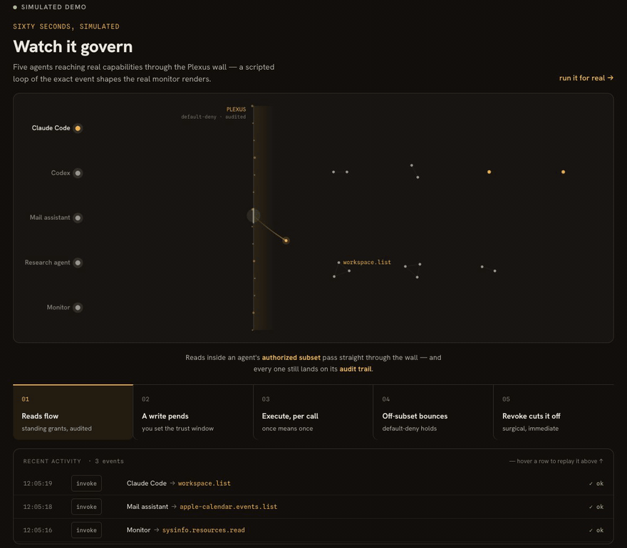
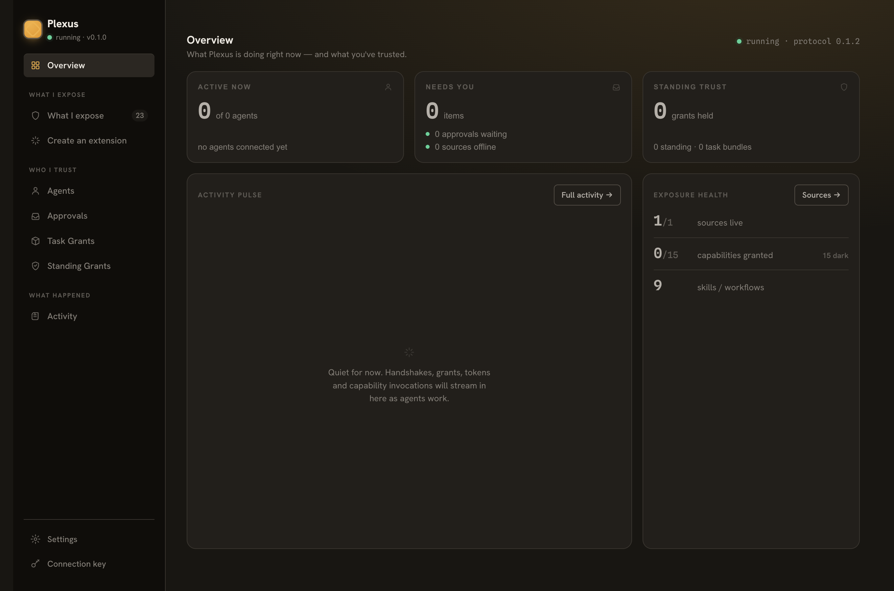
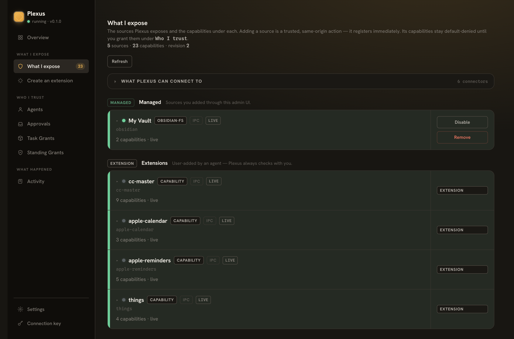
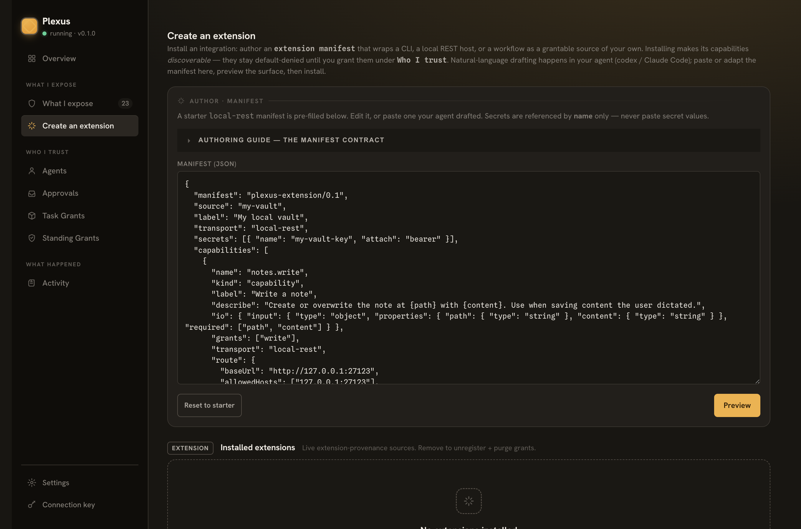

# Plexus

> **A local capability gateway for AI agents.** Plexus is a user-installed,
> open-source gateway that exposes **one** AI-native **self-describe** endpoint, so
> any AI agent can **DISCOVER → UNDERSTAND → be GRANTED → CALL** the capabilities of
> the software on *your* machine — under a trust model you can see, scope, and revoke.

[](LICENSE)
[](docs/protocol/PLEXUS-PROTOCOL.md)
[](https://bun.sh)
[](#macos-first-with-a-real-cross-platform-seam)



<p align="center"><sub>Five agents, one wall — reads flow, writes pend, execute is per-call, off-subset bounces, revoke is surgical.
<a href="https://plexus.vibecoding.icu/">Watch it live on the site →</a></sub></p>

---

## ▶︎ Try it in 5 minutes — hand it to your AI

Open **Claude Code** (or any coding agent) in this repo and say:
**"read `docs/getting-started.md` and set Plexus up for me."** It installs, starts
Plexus, configures everything (asking you for the folder to expose), connects itself as
an agent, and demonstrates one read and one write — while **you approve each grant in the
Plexus UI**. You'll watch an agent reach your Mac's capabilities with no shell, locked to
what you exposed, every powerful move approved by you.

**→ [`docs/getting-started.md`](docs/getting-started.md)** — the end-to-end runbook (also
a fine copy-paste guide if you'd rather drive by hand).

### Where to start

| You want to… | Go to |
| --- | --- |
| See what Plexus is and why | you're on the right page — read on |
| **Run it** (hand the repo to your agent) | **[`docs/getting-started.md`](docs/getting-started.md)** |
| **Understand the model + build** (install, connect an agent, author a source) | **[`docs/README.md`](docs/README.md)** — the developer reading path |

This page is the product landing page. It won't repeat the getting-started steps —
follow `docs/README.md` for those.

---

## Why Plexus

MCP answers *"what functions do I have?"* Plexus answers *"how should you use me?"* —
it wraps the functions in **usage knowledge**, a **legible trust model**, and an
**audit trail**, then brokers them to agents over a stable, AI-native protocol.

The point isn't another tool registry. It's the surface no vendor ships a server
for: **the local macOS software you already use.** Plexus turns your Obsidian vault,
your Apple Calendar, Reminders, Notes, Mail, Contacts and Photos, your browser, your
Shortcuts, and your Claude Code
orchestration into capabilities an agent can discover and call — without you handing
over a blanket key, and without an agent ever self-granting a mutating action.

**Transparency is the product.** Default-deny, per-capability, scoped, revocable,
audited — that trust story *is* the value, not a tax on it.

---

## Quick start (macOS)

Plexus runs on [Bun](https://bun.sh) (≥ 1.3.0). Install Bun if you don't have it
(`curl -fsSL https://bun.sh/install | bash`), then:

```sh
# 1. Install dependencies (workspace monorepo)
bun install

# 2. Boot the gateway — loopback only (127.0.0.1:7077). Prints the URL, then stays
#    running (Ctrl-C to stop).
bun run start

# Optionally open an Obsidian vault read-only at boot (persists as a managed source):
bun run start --vault ~/Documents/MyVault

# Print the ADMIN connection-key (the management credential — you use it to reach
# /admin; NEVER hand it to an agent). Read from ~/.plexus/, no server needed:
bun run start --print-key

# Prove the whole DISCOVER → GRANT → CALL loop end-to-end (self-contained, no setup):
bun run demo
```

First run is automatic: the gateway creates `~/.plexus/` (connection-key, signing
secret, audit log) on first boot — nothing to configure. Open the management UI at
`http://127.0.0.1:7077/admin` to add sources, approve grants, and read the audit
trail. It's served same-origin from the gateway, so the page's HTML/assets load
key-free — but every `/admin/api/*` call still needs the connection-key. The SPA
resolves it **desktop-IPC inject → cached → one-time paste**: the Electron desktop
app injects it over IPC (no paste), while a plain browser uses a cached key or
prompts you to paste it once.

**Desktop app (Electron, macOS):** a **developer-run** tray shell supervises the
runtime as a sidecar and hosts the same admin UI, with native approval
notifications. Signed/notarized distribution and auto-update are **deferred** (the
current build is unsigned). Run it from the desktop package:

```sh
bun run --cwd packages/desktop start
```

**→ Full walkthrough: [`docs/README.md`](docs/README.md)** — the developer reading
path: install, start, add a source, connect an agent (mint a one-time code + grant a
starting cap-set), and approve a grant with the trust-window picker.

---

## Concepts (the 60-second model)

**Two credentials, never conflated.** This is the whole trust story:

- **connection-key** (`plx_live_…`) — the **admin / management** credential, and the
  trust boundary. The owner-as-admin holds it; rotating it revokes everything at once.
  **Agents never see or use it.**
- **per-agent PAT** (`plx_agent_…`) — each agent's **own durable credential**. It is
  redeemed **once** from a one-time enrollment code, hashed at rest, and revocable per
  agent. The PAT-authenticated handshake binds the *real* agentId — an agent can't
  self-assert someone else's identity.

**The flow is admin → agent, not agent-helps-itself:**

1. **The admin connects an agent.** In the console's **Connect an agent** wizard (or
   `POST /admin/api/agents/connect`) you name the agent, grant it a **starting cap-set**,
   and Plexus mints a **one-time enrollment code** (`plx_enroll_…`, 15-min, single-use).
   You hand the agent **one command** — never the connection-key.
2. **The agent installs once.** It runs the one-command install
   (`curl -fsSL <gateway>/integration/<agentId>/install.sh | …`), which redeems the code
   → stores its **PAT** (0600) → drops a compiled plugin exposing a per-agent launcher
   **`plexus-<agentId>`** on its PATH.
3. **The agent discovers + calls through its launcher.**
   `plexus-<agentId> list` shows what it can call **right now** (standing-granted) vs what
   **needs approval**; `plexus-<agentId> <capabilityId>` invokes. **That launcher is the
   agent's complete and only interface** — it never hand-rolls HTTP and never guesses auth.

What you **expose** is modeled as **Connector → Source → Capability**: a managed source
(e.g. an Obsidian vault) registers capabilities (e.g. `obsidian.vault.read`) live with
**no restart** — they appear immediately in the admin surface, and an agent discovers
them once the owner adds them to that agent's **authorized subset**. What you **trust**
is a unified model:
per-capability **scoped grants**, **trust-windows** (`once` / `1h` / `1d` / `7d` /
`until-revoked`), **3-class provenance** (first-party / managed / extension), a
**sensitivity** rating, and the **`GET /grants` ledger** where every standing grant is
visible and revocable.

**Standing is decided by sensitivity, not origin.** A `read` capability lands
**standing** (frictionless re-use, 1d/7d) at connect. A side-effecting capability
(**write / execute**, e.g. `claudecode.run`) is approved **per use** by default — a
posture the agent can never lift itself. Only the **owner** can lift it, per agent +
per capability: the **standing** opt-in at connect (default **off**, double-confirmed —
the only path for `execute`), or, for a `write`, approving its pending request with a
real trust window or granting it directly; once lifted, it rides a real trust-window /
until-revoked.

**The agent interface is compiled, not bolted on.** The per-agent launcher ships inside
a Claude Code plugin that is a **projection over the always-present self-describing
floor** (`.well-known` + `requestShapes` + how-to-use). The floor works for *any* agent
with no plugin at all; the plugin is a cache/shortcut that makes the same capabilities
feel more native per agent — never a replacement, and never a place a durable secret is
baked in.

**→ Deep dive: [`docs/concepts.md`](docs/concepts.md)** ·
**Security model: [`docs/design/security-model.md`](docs/design/security-model.md)** ·
**Protocol contract: [`docs/protocol/PLEXUS-PROTOCOL.md`](docs/protocol/PLEXUS-PROTOCOL.md)**

---

## What's exposed

**First-party sources** (macOS-first; **code + hermetic-test verified** — live E2E
against real macOS TCC apps was **not run this round**, see
[KNOWN-LIMITATIONS](docs/KNOWN-LIMITATIONS.md)):

- **Obsidian** — read-only path-confined filesystem read (`obsidian.vault.read`), or
  read-**write** via the Obsidian Local REST API plugin (`obsidian-rest.vault.{list,read,write}`).
- **Apple Calendar** — read-only (`grants:["read"]` by construction).
- **Apple Reminders** — read **and** write.
- **Apple Notes** — read + a **create-only** write (`apple-notes.notes.create`; no
  update/delete exists).
- **Apple Mail** — strictly **read-only** (mailboxes, bounded search, read one message;
  no draft/send exists).
- **Apple Contacts** — read-only search + full-card read.
- **Apple Photos** — read posture: albums, metadata-only search, and a jailed export
  (`~/.plexus/exports/photos/`).
- **Shortcuts** — list (read) + run (**execute** → pends; record-mode by default,
  real launch is owner opt-in).
- **Browser** — read-only Safari/Chrome tabs, bookmarks, history (per-browser
  graceful degradation).
- **Workspace** (`workspace`) — one authorized working directory as a path-confined
  filesystem: read (`workspace.{list,read}`) **and** write (`workspace.write` → pends).
- **Claude Code** (`claudecode`) — headless Claude Code under macOS `sandbox-exec`
  confinement (`claudecode.run`, `execute` → pends).
- **Codex** (`codex`) — headless `codex exec` under the same sandbox confinement, a
  mirror of `claudecode.run` (`codex.run`, `execute` → pends).

Each source reports its own **health** (agent-facing field + the admin dashboard via
`GET /admin/api/health`), so an agent — and you — can see when a backing app is
unreachable before a call fails.

**User extensions** — author a manifest, **preview the security surface** (cli bins,
rest hosts, cross-source attaches, per-capability verbs), then install it live:

```sh
plexus extension preview ./my-source.json   # validate + show the security surface (no commit)
plexus extension add     ./my-source.json   # install live (you are the human approver)
plexus extension list
plexus extension remove  my-source
```

Or do all of it from the `/admin` UI. An **authoring guide** for coding agents is
served at `GET /admin/api/extensions/authoring-guide`.

**→ Tutorials:** [connect an agent](docs/tutorials/connect-an-agent.md) ·
[create an extension](docs/tutorials/create-an-extension.md) ·
[first-party sources](docs/tutorials/first-party-sources.md)

---

## Screenshots

**Overview** — the dashboard: what's exposed, what needs you, recent activity.



**What I expose** — the Connector → Source → Capability surface, with the dynamic
config form for adding a source.



**Create an extension** — author a manifest and preview its security surface before
it ever goes live.



---

## Security posture

- **Loopback by default.** The gateway binds `127.0.0.1` only. Binding to a chosen
  NIC or `0.0.0.0` is **opt-in** (`~/.plexus/network.json`), and when you do, **every
  `/admin/api/*` route is connection-key gated** — the connection-key becomes the
  trust boundary for the LAN.
- **Host/Origin guard** on every endpoint before auth (DNS-rebinding defense); a
  request without the matching `Host` is rejected (`host_forbidden`, 403).
- **Default-deny, scoped invoke.** A grant is per-capability and verb-scoped; tokens
  are short-lived. Mutating (`write`/`execute`) grants pend for a human — an agent
  cannot self-grant them.
- **Re-gating on change.** Reconfiguring a source's endpoint/secret purges its grants,
  so a prior approval can't silently carry over to a new target.
- Secrets are stored under `~/.plexus/secrets/` and referenced by **name** — never
  written into config files, never echoed back.

**→ Full write-up: [`docs/security.md`](docs/security.md)**

---

## macOS-first, with a real cross-platform seam

Plexus is a **Bun + TypeScript + Hono** workspace monorepo:

```
packages/
  protocol/    the keystone — the compiler-enforced wire contract (frozen at 0.1.3)
  runtime/     the headless loopback gateway (discovery, grants, invoke, audit, sources)
  cli/         the `plexus` CLI (discover / manifest / skills / call / source / extension / bundle)
  web-admin/   the same-origin React management UI
  desktop/     the Electron shell (macOS) — supervisor + tray + native notifications
```

The OS surface lives behind a single `PlatformServices` seam: macOS is the shipped,
fully-implemented target, and **Linux is implemented and end-to-end verified** — the
headless portable gateway runs on a real Linux kernel in Docker (Ubuntu + Bun; see
[`docs/deploy-linux.md`](docs/deploy-linux.md)), auto-gating first-party sources to the
portable `{workspace, sysinfo}` set. **Windows** is implemented behind the **same seam**
but not yet validated on a real Windows host — so cross-platform is a fill-in, not a
rewrite.

The **protocol is frozen at `PLEXUS_PROTOCOL_VERSION = 0.1.3`** and evolves
**additive-only** — new optional fields, never a breaking change to the wire.

---

## Versioning — two numbers, two clocks

Plexus carries **two independent version numbers**, and the distinction matters:

| | What it is | How it moves | Who depends on it |
|---|---|---|---|
| **Software version** (`PLEXUS_VERSION`, e.g. `0.7.0`) | the **product** release — the gateway, desktop app, sources, UI | **fast** — every feature/fix bumps it | nobody on the wire; it's informational (shown in the admin UI as `running · v0.7.0`) |
| **Protocol version** (`PLEXUS_PROTOCOL_VERSION`, `0.1.3`) | the **agent-facing wire contract** — the shapes of discover / handshake / grant / invoke | **rarely** — frozen, **additive-only** (a new optional field bumps the patch) | **agents** integrate against *this*, never the software version |

They are **decoupled by design**: the product can ship `0.6 → 0.7 → 1.0 …` while the
protocol stays `0.1.x`, because **the wire is stable under a fast-moving app**. An agent
that integrated at protocol `0.1.0` keeps working across every software release — it only
needs to care when the *protocol* version changes (and even then, additively). The admin
UI surfaces both, distinctly: `running · v<software> · protocol <protocol>`.

> Tags/releases track the **software** version (`v0.7.0`). The protocol version lives
> in code (`@plexus/protocol`) and `.well-known/plexus`, and bumps on its own schedule.

---

## Build, test, typecheck

```sh
bash run-tests.sh    # the canonical gate: bunx tsc --noEmit (strict) + bun test
bunx tsc --noEmit    # typecheck only
bun test             # tests only
```

See [`CONTRIBUTING.md`](CONTRIBUTING.md) for the monorepo layout, the additive-only
protocol rule, and how to author a source module or an extension.

---

## Docs

| Doc | What it covers |
| --- | --- |
| **[Developer reading path](docs/README.md)** | **Start here to understand + build** — the spine that orders the docs below. |
| [Getting started (macOS)](docs/getting-started.md) | Install → start → connect an agent (mint a code + grant a cap-set), end to end. |
| [Concepts](docs/concepts.md) | The self-describe protocol, the trust model, sources & extensions. |
| [Security](docs/security.md) | Loopback boundary, connection-key, Host/Origin guard, re-gating. |
| [Connect an agent](docs/tutorials/connect-an-agent.md) | Drive Plexus from a coding agent. |
| [Create an extension](docs/tutorials/create-an-extension.md) | Author + preview + install a manifest. |
| [First-party sources](docs/tutorials/first-party-sources.md) | Obsidian, Apple Calendar/Reminders/Notes/Mail/Contacts/Photos, Shortcuts, browser, Claude Code. |
| [Protocol contract](docs/protocol/PLEXUS-PROTOCOL.md) | The frozen wire spec + the ADRs. |
| [Known limitations](docs/KNOWN-LIMITATIONS.md) | Honest pre-1.0 state: MCP ingestion, `io.input` scope, desktop/cross-platform not E2E-verified. |

---

## Contributing & conduct

Contributions welcome — see [`CONTRIBUTING.md`](CONTRIBUTING.md). This project follows
the [Contributor Covenant](CODE_OF_CONDUCT.md).

## License

[MIT](LICENSE) © 2026 Plexus contributors.
