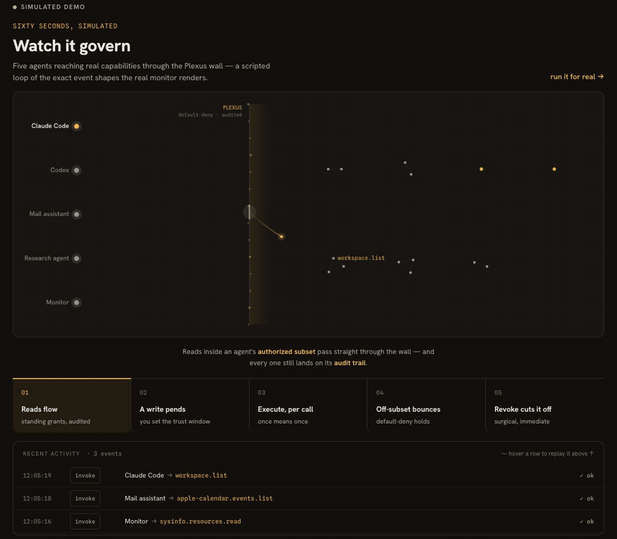
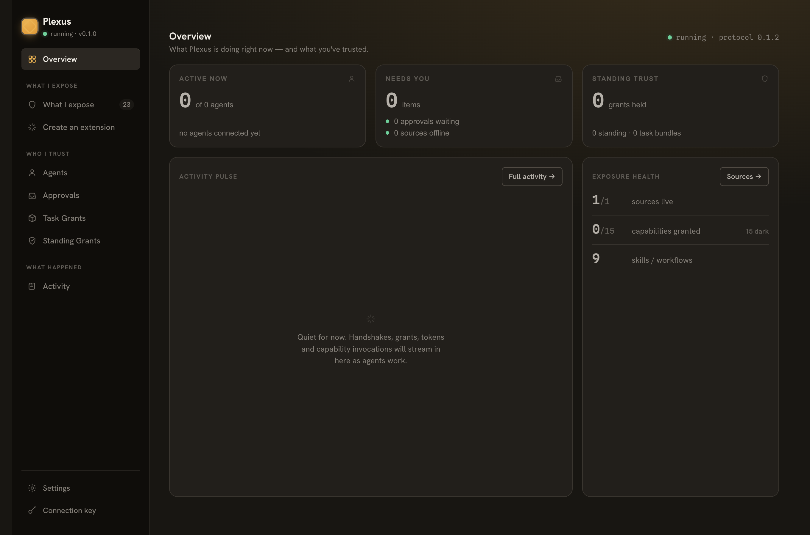
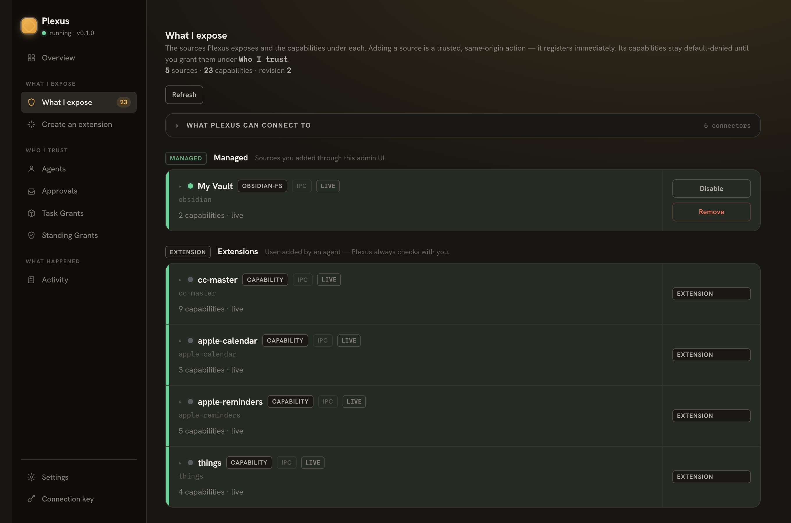
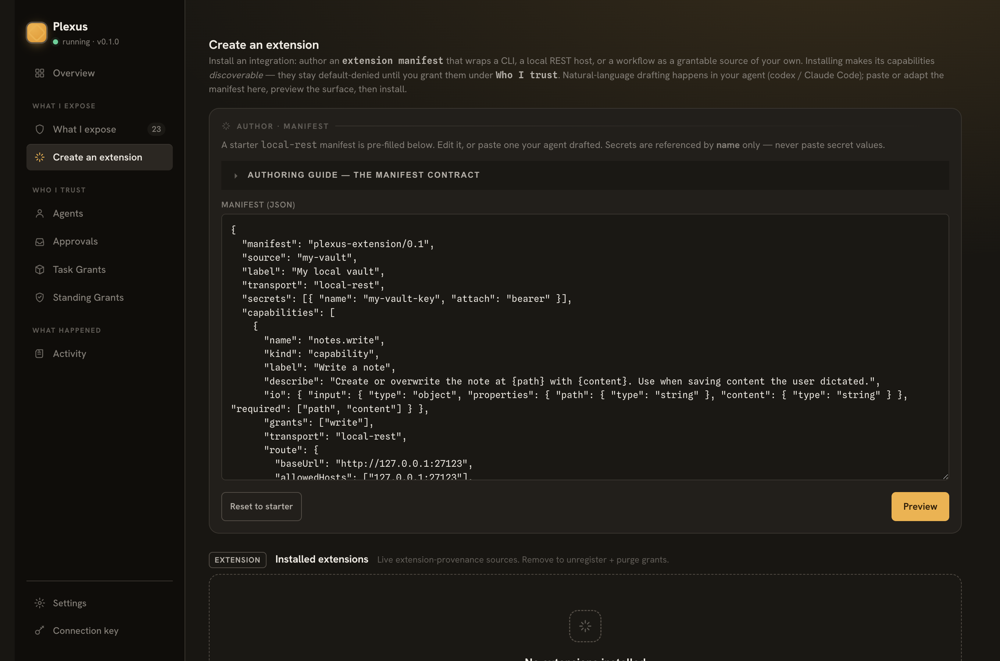

<a id="plexus"></a>

# Plexus

[English](./README.md) · [中文](./README.zh-CN.md)
> Plexus 是你安装在自己机器上的开源网关，让任何 AI agent 都能发现并使用本机软件的能力。它提供一个面向 AI 的 `self-describe` 入口：agent 从这里发现能力、读懂用法，取得授权后再调用，也就是 DISCOVER → UNDERSTAND → be GRANTED → CALL。开放哪些能力、允许多大范围，都由你控制。这套信任机制看得见，范围可以限定，授权也可以撤销；发现能力并不等于获准调用。

[](LICENSE)
[](docs/protocol/PLEXUS-PROTOCOL.md)
[](https://bun.sh)
[](#macos-first-with-a-real-cross-platform-seam)



<p align="center"><sub>五个 agent，都经过同一道 Plexus 边界。演示中，读取沿用持续授权，写入等待批准，execute 每次单独授权；子集之外的请求被挡住，撤销授权只切断对应的访问。
<a href="https://plexus.vibecoding.icu/">到网站看实时演示 →</a></sub></p>

---

<a id="▶︎-try-it-in-5-minutes-—-hand-it-to-your-ai"></a>

## 花 5 分钟试用——交给你的 AI
在这个仓库中打开 Claude Code，或任何编程 agent，对它说：“阅读 `docs/getting-started.md`，帮我把 Plexus 配置好。”

它会完成安装、启动和配置，询问你要开放哪个文件夹，再把自己作为 agent 接入，演示一次读取和一次写入。这次设置和演示涉及的每项授权，都由你在 Plexus UI 中批准。你可以亲眼看到 agent 不借助 shell，直接使用 Mac 上的能力，访问范围限定在你选择开放的部分。

有了仍然适用的持续授权，后续调用就可以沿用，不必每次重新询问你。需要另行批准的操作，仍须等你授权后才能执行。

→ [`docs/getting-started.md`](docs/getting-started.md) 包含从安装到演示的完整步骤。想自己操作，也可以照着这份指南逐步复制执行。

<a id="where-to-start"></a>

### 从哪里开始读
| 你想做什么 | 去哪里 |
| --- | --- |
| 了解 Plexus 是什么，为什么要做它 | 就在这一页，继续往下读 |
| 跑起来，把仓库交给 agent 操作 | [`docs/getting-started.md`](docs/getting-started.md) |
| 理解模型并动手开发，包括安装、接入 agent、编写 source | [`docs/README.md`](docs/README.md)——开发者阅读路线 |

这一页是产品介绍页，不重复入门操作步骤。需要安装和接入指南，可以从 `docs/README.md` 找到相应文档。

---

<a id="why-plexus"></a>

## 为什么需要 Plexus
Plexus 把你已有的 Obsidian vault、Apple Calendar、Reminders、Notes、Mail、Contacts 和 Photos，以及浏览器、Shortcuts 和 Claude Code 编排，变成 agent 可以发现和调用的能力。这些都是你在本机使用的 macOS 软件。接进去之后，光有函数名还不够，agent 需要知道怎么用。权限申请要让你看得懂；出了问题，也要有记录可查，知道它做过什么。

MCP 已有基于 OAuth 的授权框架，包括授权服务器发现、scopes 和访问令牌验证。Plexus 将本机能力连同用法知识，通过稳定、面向 AI 的协议提供给 agent；机主批准、逐项能力策略和审计账本，则让使用这些能力的信任关系有据可查。函数清单不能代替这些安排，接入本机软件后，它们直接关系到你能否放心让 agent 动手。

你不必交出一把通行所有能力的钥匙。你选定的能力，以及你为该 agent 创建、未过期且通过当前 `connection-key` epoch 校验的有效常驻授权所涵盖的能力，都在它的有效授权范围内；其中仍开放的能力才可被发现，实际调用仍须取得限定范围的授权。有副作用的写入和执行默认逐次授权；你可以为指定 agent 和能力明确设置常驻授权，写入也可以在你批准有效信任窗口后获得常驻授权。执行的常驻权限必须由你明确开启，agent 不能自行提高权限，更不能自行批准任何会改变状态的操作。

透明就是产品本身。默认拒绝，按能力设定策略，限定授权范围，允许撤销，并留下审计记录：你能看懂自己允许了什么，也能追查实际发生了什么。这些控制和记录本身就是 Plexus 的价值，不是为了获得价值而不得不承担的额外负担。

---


<a id="quick-start-macos"></a>

## 快速开始（macOS）
Plexus 运行在 [Bun](https://bun.sh) 上，要求版本至少为 1.3.0。如果还没安装 Bun，先执行 `curl -fsSL https://bun.sh/install | bash`。接着在仓库中安装依赖，再启动网关：

```sh
# 1. Install dependencies (workspace monorepo)
bun install

# 2. Boot the gateway — loopback only (127.0.0.1:7077). Prints the URL, then stays
#    running (Ctrl-C to stop).
bun run start

# Optionally open an Obsidian vault read-only at boot (persists as a managed source):
bun run start --vault ~/Documents/MyVault

# Print the ADMIN connection-key (the management credential — you use it to reach
# /admin; NEVER hand it to an agent). Read from ~/.plexus/, no server needed:
bun run start --print-key

# Prove the whole DISCOVER → GRANT → CALL loop end-to-end (self-contained, no setup):
bun run demo
```

基本启动只需前两步。网关仅监听本机回环地址 `127.0.0.1:7077`，打印访问 URL 后会持续运行，按 Ctrl-C 停止。首次启动时，它会自动创建 `~/.plexus/`，在其中保存 connection-key、签名密钥和审计日志，不需要预先配置这些内容。

如果想在启动时接入一个 Obsidian vault，可以使用带 `--vault` 的命令。它会以只读方式打开指定的 vault，并将其持久保存为受管理的 source。只想先看完整调用流程，也可以运行 `bun run demo`：这个演示自成一体，无须事先设置，就能走完 DISCOVER → GRANT → CALL。

网关启动后，打开 `http://127.0.0.1:7077/admin`。你可以在管理 UI 中添加 source、批准授权，也可以查看审计记录，追查已经发生的操作。页面由网关同源提供，加载 HTML 和静态资源不需要 key；但每一次 `/admin/api/*` 调用仍然需要 connection-key。页面能打开，并不代表管理 API 已经通过认证。

这套 SPA 获取 connection-key 的顺序是：桌面 IPC 注入 → 已缓存的 key → 手动粘贴一次。Electron 桌面应用会通过 IPC 注入，所以不用粘贴；在普通浏览器里，页面先使用缓存的 key，没有缓存时才提示你粘贴一次。

需要查看 connection-key 时，可以运行上面的 `--print-key` 命令。它直接从 `~/.plexus/` 读取，不需要启动服务器。这是你访问 `/admin` 的管理凭据，绝不能交给 agent。

macOS 桌面应用目前是一个由开发者自行运行的 Electron 托盘外壳。它监管作为 sidecar 运行的 runtime，承载同一套管理 UI，并提供原生审批通知。当前构建未经签名；签名与公证后的分发、自动更新都留待后续实现。从 desktop 包启动它：

```sh
bun run --cwd packages/desktop start
```

→ [开发者完整操作指南](docs/README.md) 按实际操作顺序展开：安装、启动、添加 source，再接入 agent。接入时会生成一次性代码，并授予起始 cap-set；指南也会带你使用信任窗口选择器批准一项授权。

---

<a id="concepts-the-60-second-model"></a>

## 核心概念（60 秒读懂）
Plexus 把管理者和 agent 的凭据分开。connection-key（`plx_live_…`）由机主作为管理员持有，用来管理网关，也是信任边界：轮换它，会一次撤销全部访问。agent 从不接触或使用它。

每个 agent 有自己的长期凭据 PAT（`plx_agent_…`），用一次性接入码兑换取得。网关以哈希形式保存 PAT，可以按 agent 单独撤销。用 PAT 认证的握手会绑定真实的 `agentId`，agent 不能靠自报身份冒充另一个 agent。

接入由机主发起。在控制台的“接入 agent”向导中，或通过 `POST /admin/api/agents/connect`，你给 agent 命名，授予起始 cap-set。Plexus 随后生成一次性接入码（`plx_enroll_…`），15 分钟内有效，只能兑换一次。这是接入码的兑换期限，与 token 或会话的有效期是不同的事。你交给 agent 一条安装命令，始终把 connection-key 留在自己手里。

agent 只需安装一次，运行 `curl -fsSL <gateway>/integration/<agentId>/install.sh | …`。脚本兑换接入码，将 PAT 保存为权限模式 `0600` 的文件，再安装编译生成的插件，让专属 launcher `plexus-<agentId>` 出现在 `PATH` 上。

接下来，`plexus-<agentId> list` 会区分哪些能力已有常驻授权、现在就能调用，哪些仍需批准；`plexus-<agentId> <capabilityId>` 用来发起调用。对于使用这套编译集成的 agent，launcher 就是完整且唯一的接口，凭据的取得和使用都由它封装，agent 不自行拼装 HTTP 请求，也不猜测认证方式。

你开放的资源按 Connector → Source → Capability 组织。一个 Obsidian vault 经 Connector 接入，成为受管理的 Source；它注册的具体操作，如 `obsidian.vault.read`，就是 Capability。注册实时生效，无须重启，管理界面立即可见。机主把能力加入某个 agent 的选定子集，或为该 agent 的这项能力创建符合条件且仍有效的常驻授权后，能力还须保持开放，该 agent 才能发现它。

握手返回一个会话，以及按该 agent 的有效授权范围和开放状态过滤后的子集 manifest。选入子集只划定可发现的范围，按能力限定的授权（scoped grants）和 token 仍须另行取得，清单本身不授予调用权限。开放状态还有独立的否决权：机主关闭一项能力后，发现和授权都会被阻止；调用时，网关会在检查 grant 之前拒绝它，即使已有有效授权也不能通过。

授权按能力记录，连同三类来源（`first-party`、`managed`、`extension`）、敏感度和信任窗口一起管理。敏感度由来源、操作动词和传输方式共同决定，不能只看来源就判断能否给予常驻授权。信任窗口包括 `once`、`1h`、`1d`、`7d` 和 `until-revoked`，记录机主这次授权决定能沿用多久。

接入时，选中的 `read` 能力会获得常驻授权，在 `1d`／`7d` 窗口内可以直接重复使用，不必每次再询问机主。有副作用的 `write`／`execute` 能力，如 `claudecode.run`，默认逐次批准，agent 无权自行放宽。只有机主能为指定 agent 的指定能力开启常驻授权：接入时的 standing 选项默认关闭，须二次确认，这也是 `execute` 获得常驻授权的唯一途径。对于 `write`，机主还可以在批准待处理请求时给予实际的信任窗口，或直接授予常驻授权。放宽之后，授权仍受相应窗口约束，也可以设为 `until-revoked`。

所有常驻授权都会列入 `GET /grants` 账本，有记录可查，也都可以撤销。已有授权仍然适用时，agent 可以沿用，无须重新请求人工批准。

这套编译集成随 Claude Code 插件交付，是始终可用的自描述 Floor 的投影。公开的 `.well-known` 入口描述网关身份、端点、`requestShapes` 和接入方式，Floor 还提供 how-to-use 用法说明。公开入口不泄露凭据，也不发布完整的各 agent manifest；对应的子集清单在认证握手后才返回。

任何 agent 都可以不装插件，直接通过 HTTP 使用 Floor。插件只是缓存和快捷入口，让同样的能力更贴近不同 agent 的使用方式，不能取代 Floor，也不会把长期密钥写进编译产物。读懂操作和获准调用是两件事；即使插件缓存的说明已经过时，实际调用仍须通过网关按当前权限执行的检查。

→ [深入理解概念](docs/concepts.md) · [安全模型](docs/design/security-model.md) · [协议约定](docs/protocol/PLEXUS-PROTOCOL.md)

---

<a id="what-s-exposed"></a>

## 可以使用哪些能力
第一方 source 以 macOS 为优先平台，已通过代码检查和隔离环境测试（hermetic tests）。本轮没有针对真实 macOS TCC 应用运行 live E2E 测试，具体见[已知限制](docs/KNOWN-LIMITATIONS.md)。下面列的是各 source 提供的操作，以及各自的访问边界。

- Obsidian：直接访问文件系统时，只能在限定路径内读取（`obsidian.vault.read`）；通过 Obsidian Local REST API 插件接入时，则可以列出、读取和写入（`obsidian-rest.vault.{list,read,write}`）。
- Apple Calendar：只读。它在构建时就将授权限定为 `grants:["read"]`。
- Apple Reminders：可以读取，也可以写入。
- Apple Notes：可以读取；写入只支持创建笔记（`apple-notes.notes.create`），没有更新或删除操作。
- Apple Mail：严格只读。可以查看邮箱列表、在限定范围内搜索，以及读取单封邮件；没有草稿或发送操作。
- Apple Contacts：只读，可以搜索联系人，也可以读取完整的联系人卡片。
- Apple Photos：按读取能力开放，包括相簿、仅针对元数据的搜索，以及受目录限制的导出。导出文件只能放在 `~/.plexus/exports/photos/` 内。
- Shortcuts：列出快捷指令属于 `read`，运行属于 `execute`，默认挂起等待批准。运行默认采用记录模式（record-mode）；是否真正启动快捷指令，须由机主明确选择开启。
- Browser：只读访问 Safari／Chrome 的标签页、书签和历史记录。各浏览器分别处理不可用情况，支持降级。
- Browser control（`browser-control`）：通过 DevTools Protocol（CDP）控制真实的 Chrome，不依赖 Puppeteer／Playwright。机主先决定让 agent 使用哪个浏览器：默认的 `launch` 会用全新、空白的配置启动 Chrome，没有 cookies，也没有登录会话；选择 `attach` 则接入机主已经登录的浏览器，必须由机主明确开启。

  在已授权的页面内，`click` 加 `type` 已经赋予 agent 完整的用户操作能力，因此页面内的操作全部开放，包括执行任意 JavaScript。保留限制的是 CDP 中作用于整个浏览器的部分：`Target`、`Browser`、`Storage` 和 cookie jar 都不开放。这样，域名允许列表才有实际约束力。上传文件也有边界，只能从机主指定的目录中取文件。
- Workspace（`workspace`）：把一个已授权的工作目录作为文件系统开放，访问受该目录的路径边界限制。可以列出和读取文件（`workspace.{list,read}`），也可以写入（`workspace.write`），写入默认挂起等待批准。
- Claude Code（`claudecode`）：在 macOS `sandbox-exec` 的沙箱限制下，以无界面方式运行 Claude Code。`claudecode.run` 属于 `execute`，默认挂起等待批准。
- Codex（`codex`）：在同样的沙箱限制下，以无界面方式运行 `codex exec`。`codex.run` 是 `claudecode.run` 的对应实现，同属 `execute`，默认挂起等待批准。

这里的“挂起”是写入和执行的默认授权方式。已有适用的常驻授权时，可以沿用；其中，`execute` 的常驻授权必须由机主明确开启，agent 不能自行放宽。

每个 source 都会报告自己的健康状态。agent 可以从面向它的字段中读取，你也可以在管理面板中查看，面板通过 `GET /admin/api/health` 获取这些状态。底层应用无法访问时，双方都能提前看到，不必等到一次调用失败才知道。

要添加自己的 source，可以编写用户扩展。先写好 manifest，再预览它涉及的安全范围：CLI 可执行程序、REST 主机、跨 source 的 attach，以及每项 capability 的操作动词。确认这些内容后，就可以在线安装：

```sh
plexus extension preview ./my-source.json   # validate + show the security surface (no commit)
plexus extension add     ./my-source.json   # install live (you are the human approver)
plexus extension list
plexus extension remove  my-source
```

`preview` 会校验 manifest 并展示安全范围，不提交安装；执行 `add` 时，你就是批准安装的人。后两条命令分别用于列出扩展和移除指定扩展。

这些操作也都可以在 `/admin` UI 中完成。供编程 agent 使用的扩展编写指南由 `GET /admin/api/extensions/authoring-guide` 提供。

→ 教程：[接入 agent](docs/tutorials/connect-an-agent.md) · [创建扩展](docs/tutorials/create-an-extension.md) · [第一方 source](docs/tutorials/first-party-sources.md)

---

<a id="screenshots"></a>

## 界面截图
总览：管理面板列出已开放的能力、需要你处理的事项，以及最近的活动。



我开放的能力：按 Connector → Source → Capability 查看开放范围，添加 source 时，界面会提供动态配置表单。



创建扩展：编写 manifest，在扩展上线前预览它涉及的安全范围。



---

<a id="security-posture"></a>

## 安全边界
界面里管理的这些权限，由网关在请求到达时检查。网关默认只绑定回环地址 `127.0.0.1`。如果要绑定指定网卡，或通过 `0.0.0.0` 监听所有接口，须在 `~/.plexus/network.json` 中明确开启。每条 `/admin/api/*` 路由都要求 connection-key；向局域网开放后，这把管理凭据就是局域网访问的信任边界。

在认证之前，每个端点都会先检查 Host/Origin，防御 DNS 重绑定。请求没有匹配的 `Host`，就会被拒绝，返回错误码 `host_forbidden`，HTTP 状态码为 403。这道检查在验证凭据之前执行。

调用默认拒绝。每项 grant 都限定到具体 capability 和操作动词，token 也只有较短的有效期。token 能用多久，与机主这次批准能沿用多久，是两回事；后者由授权的信任窗口决定。

有副作用的 `write`／`execute` 默认逐次申请，挂起等待机主批准，agent 不能自行授权。已有适用的常驻授权时，可以沿用。机主可以为指定 agent 的指定 capability 明确开启常驻授权，`execute` 的常驻权限必须经过这一步；`write` 还可以在机主批准待处理请求、给予实际信任窗口后成为常驻授权，或由机主直接授予。

批准针对的目标也不能悄悄换掉。重新配置 source 的端点或 secret，会清除该 source 的 grants，重新经过授权检查。先前对旧目标的批准，不能自动带到新目标上。

secret 保存在 `~/.plexus/secrets/` 下，使用时按名称引用。配置文件不写入 secret 的值，返回内容也不会回显它们。

→ 完整安全说明：[`docs/security.md`](docs/security.md)

---

<a id="macos-first-with-a-real-cross-platform-seam"></a>

## 以 macOS 为起点，平台差异有统一的接口
Plexus 用 Bun + TypeScript + Hono 构建，代码组织在一个 workspace monorepo 中。无界面的回环网关负责发现、授权、调用、审计和 source 管理；命令行工具、管理页面和桌面外壳各有自己的包。通信契约单独放在 `protocol` 中，由编译器强制约束：

```
packages/
  protocol/    the keystone — the compiler-enforced wire contract (frozen at 0.1.3)
  runtime/     the headless loopback gateway (discovery, grants, invoke, audit, sources)
  cli/         the `plexus` CLI (discover / manifest / skills / call / source / extension / bundle)
  web-admin/   the same-origin React management UI
  desktop/     the Electron shell (macOS) — supervisor + tray + native notifications
```

与操作系统打交道的部分，统一放在 `PlatformServices` 接口之后。macOS 是已经交付、实现完整的目标平台。面向 macOS 的 Electron 桌面外壳负责进程监管、托盘和原生通知；同源的 React 管理 UI 则放在 `web-admin` 中。网关和桌面外壳在包结构上分开，平台相关实现也有明确的归处。

Linux 已经实现，并通过端到端验证。验证时，无界面的可移植网关运行在 Docker 中，使用 Ubuntu + Bun，底下是真实的 Linux 内核。网关在 Linux 上会自动把第一方 source 限制为可移植的 `{workspace, sysinfo}` 集合。部署方法见 [`docs/deploy-linux.md`](docs/deploy-linux.md)。

这个验证范围需要说清楚：跑通的是可移植网关，macOS 专属的应用 source 仍受平台限制，不会因此在 Linux 上可用。应用 source 通过隔离环境测试，也不能代替接入真实应用的验证。

Windows 同样已有实现，使用的也是 `PlatformServices` 这个接口，但还没有在真实 Windows 主机上验证。因此，跨平台工作已有可以继续补齐的平台实现边界，无须重写整个系统；各平台实际支持到哪里，仍要连同验证状态一起看。

协议则冻结在 `PLEXUS_PROTOCOL_VERSION = 0.1.3`，只允许以 additive-only 的方式演进：可以增加新的可选字段，不能引入破坏现有通信契约的变更。

---

<a id="versioning-—-two-numbers-two-clocks"></a>

## 版本号：产品和协议各自更新
你在管理界面里查看软件版本，是为了知道正在运行哪一版 Plexus；agent 接入时依据协议版本，确定双方通信的数据格式。Plexus 分别记录这两个数字，更新节奏也不同。下面的软件版本号都是示例。

| 版本 | 表示什么 | 怎样更新 | 谁依赖它 |
|---|---|---|---|
| 软件版本（`PLEXUS_VERSION`，例如 `0.9.1`） | 产品的发布版本，包括网关、桌面应用、sources 和 UI | 更新快，每次新增功能或修复问题都会递增 | 通信双方都不以它作为接入依据；它只提供版本信息，管理 UI 显示为 `running · v0.9.1` |
| 协议版本（`PLEXUS_PROTOCOL_VERSION`，`0.1.3`） | 面向 agent 的通信契约，规定 `discover`／`handshake`／`grant`／`invoke` 的数据结构 | 很少更新；契约已冻结，只允许增量扩展（additive-only），新增一个可选字段就递增 patch 版本 | agent 按这个版本接入，始终不依赖软件版本 |

这两个版本在设计上就相互独立。产品可以从 `0.6 → 0.7 → 1.0 …` 不断发布，协议仍停留在 `0.1.x`：应用更新得快，底下的通信契约依然稳定。软件版本递增，不能据此推断 agent 使用的接口也变了。

因此，按协议 `0.1.0` 接入的 agent，在每一次软件发布后仍能继续工作。这个兼容性保证以协议只做增量扩展、不破坏已有契约为前提。agent 只需在协议版本变化时关注相应变化，而这些变化也必须遵守同一约定。

管理 UI 会同时显示两者，并明确区分：`running · v<software> · protocol <protocol>`。其中，`<software>` 告诉机主当前运行的产品版本，`<protocol>` 则给出 agent 接入所依据的协议版本。

> 标签和发布记录跟随软件版本，例如 `v0.9.1`。协议版本记录在代码（`@plexus/protocol`）和发现入口 `.well-known/plexus` 中，按自己的节奏递增。

---

<a id="build-test-typecheck"></a>

## 构建、测试与类型检查
仓库的标准检查入口是 `bash run-tests.sh`，它会运行严格类型检查和测试。需要完整检查时，用第一条命令；只检查类型或只运行测试时，可以分别使用后两条命令。

```sh
bash run-tests.sh    # the canonical gate: bunx tsc --noEmit (strict) + bun test
bunx tsc --noEmit    # typecheck only
bun test             # tests only
```

准备动手开发，可以先读 [`CONTRIBUTING.md`](CONTRIBUTING.md)。其中介绍了 monorepo 的目录布局、协议只允许增量扩展的 additive-only 规则，以及如何编写 source 模块或 extension。

---

<a id="docs"></a>

## 文档
想按顺序理解 Plexus 并动手开发，从开发者阅读路线开始。需要查某个具体主题，也可以直接打开对应的文档。

| 文档 | 内容 |
| --- | --- |
| [开发者阅读路线](docs/README.md) | 理解 Plexus 并开始开发的入口，按阅读顺序串起下面各份文档。 |
| [快速开始（macOS）](docs/getting-started.md) | 从安装、启动到接入 agent 的完整操作流程，包括生成一次性接入码和授予 cap-set。 |
| [核心概念](docs/concepts.md) | 介绍 self-describe 协议、信任模型，以及 source 和 extension。 |
| [安全说明](docs/security.md) | 说明回环地址的安全边界、connection-key、Host/Origin 检查，以及重新进行授权检查的机制（re-gating）。 |
| [接入 agent](docs/tutorials/connect-an-agent.md) | 如何通过编程 agent 使用 Plexus。 |
| [创建扩展](docs/tutorials/create-an-extension.md) | 从编写 manifest 到预览、安装，完成一个扩展的创建过程。 |
| [第一方 source](docs/tutorials/first-party-sources.md) | 介绍 Obsidian、Apple Calendar/Reminders/Notes/Mail/Contacts/Photos、Shortcuts、浏览器和 Claude Code。 |
| [协议契约](docs/protocol/PLEXUS-PROTOCOL.md) | 已冻结的通信规范，以及相关的架构决策记录（ADRs）。 |
| [已知限制](docs/KNOWN-LIMITATIONS.md) | 说明 1.0 之前的实际状态：将 MCP server 接入为 source 的用户流程尚未交付，`io.input` 的适用范围仍有限制。可移植 Linux 网关的运行路径已通过验证；Windows 尚未经过真实主机验证，桌面分发仍未签名。 |

---

<a id="contributing-conduct"></a>

## 参与贡献与行为准则
欢迎参与贡献。具体方法见 [`CONTRIBUTING.md`](CONTRIBUTING.md)。

本项目遵循 [Contributor Covenant 行为准则](CODE_OF_CONDUCT.md)。

<a id="license"></a>

## 许可证
[MIT](LICENSE) © 2026 Plexus 贡献者。
