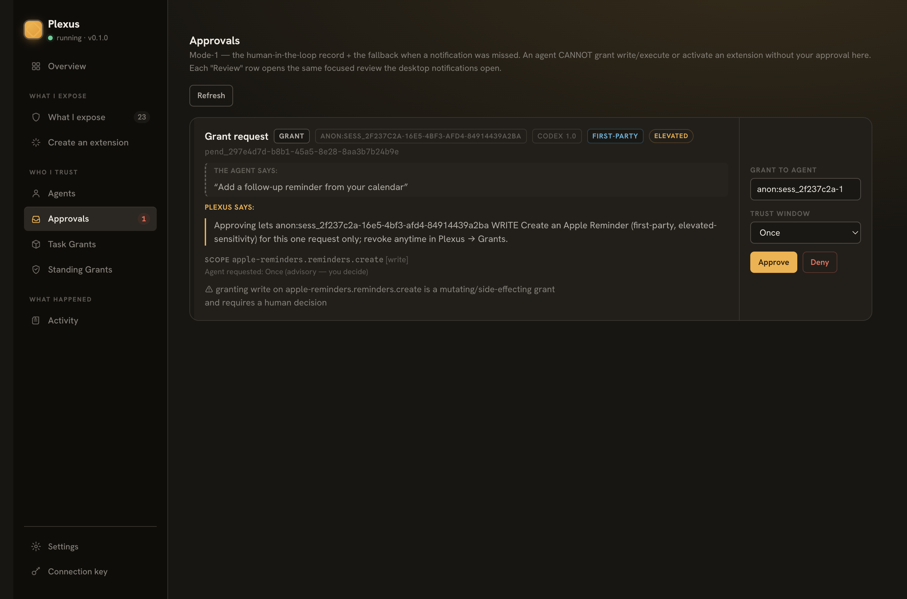

# Tutorial: Connect a real coding agent end to end

This tutorial walks a coding agent through the **whole** Plexus protocol loop —

```
DISCOVER  →  handshake (UNDERSTAND)  →  request grants (GRANTED)  →  invoke (CALL)
```

— twice, two ways:

- **Track A — the raw HTTP flow with `curl`.** You drive every endpoint by hand,
  including the **pending → approve** dance a *write* capability goes through. This
  is the ground truth: it is exactly what any agent does on the wire.
- **Track B — a real `codex` agent.** You point OpenAI's Codex CLI at a running
  Plexus and let it discover → handshake → grant → invoke on its own (e.g. *"read
  my calendar / create a reminder"*).

If you have not booted a gateway yet, do
[`docs/getting-started.md`](../getting-started.md) first (install Bun,
`bun run start`, copy the connection-key). New to the model? See the
[README](../../README.md) and [`docs/protocol/`](../protocol/) for the frozen wire
contract (`PLEXUS_PROTOCOL_VERSION = 0.1.2`, additive over `v0.1.0`).

> **The trust model in one line.** The **connection-key** is a *session-bootstrap
> secret*, not call authority. An agent presents it **once** at handshake to open a
> session; thereafter it holds short-lived **scoped tokens** and presents those as
> `Authorization: Bearer <token>` on every call. Reads on first-party / managed
> sources auto-approve; **writes (and anything on a user extension) pend for a human**.

---

## Before you start

Boot a gateway and grab two values. Run from the repo root:

```sh
# Terminal 1 — keep the gateway running (loopback only, 127.0.0.1:7077).
bun run start --vault ~/Documents/MyVault     # an Obsidian vault is handy for reads
```

```sh
# Terminal 2 — capture the base URL + connection-key for the curl track.
export BASE=http://127.0.0.1:7077
export KEY=$(bun run start --print-key)        # reads ~/.plexus/connection-key
echo "$KEY"                                    # → plx_live_…
```

> **The `Host` header is mandatory.** The gateway pins a **Host/Origin guard** to
> its bound port and runs it *before* auth on every endpoint (DNS-rebinding
> defense). A request whose `Host` is not `127.0.0.1:7077` is rejected with
> `host_forbidden` (403). Every `curl` below sends `-H "Host: 127.0.0.1:7077"`.

---

## Track A — the raw HTTP flow with `curl`

The endpoints, headers, and bodies below are exactly what
[`examples/min-agent/client.ts`](../../examples/min-agent/client.ts) (the reference
agent) sends. Where a path could move, an agent reads it from the `.well-known`
`auth` advertisement rather than hard-coding it; the canonical paths are shown.

### A1. DISCOVER — `GET /.well-known/plexus`

Pre-session, unauthenticated. Returns the gateway identity, a **summary** capability
list (enough to window-shop, not to call), and the `auth` endpoint advertisement.

```sh
curl -s -H "Host: 127.0.0.1:7077" "$BASE/.well-known/plexus" | bun -e \
  'const d = await Bun.stdin.json();
   console.log(d.gateway.name, d.gateway.version, "proto", d.gateway.protocol);
   for (const c of d.capabilities) console.log(" •", c.id);'
```

You will see ids like `obsidian.vault.read`, and (on macOS, or under
`PLEXUS_FAKE_APPLE=1`) `apple-calendar.events.list`, `apple-reminders.reminders.create`,
`things.todos.add`, etc. — see
[`first-party-sources.md`](./first-party-sources.md).

### A2. HANDSHAKE — `POST /link/handshake`

Exchange the connection-key (sent in the **body** as `connectionKey`, *not* a
header) for a `sessionId` + the **full** manifest (every entry's `describe` / `io` /
`grants` / transport).

```sh
SESSION=$(curl -s -H "Host: 127.0.0.1:7077" -H "content-type: application/json" \
  -X POST "$BASE/link/handshake" \
  -d "{\"connectionKey\":\"$KEY\",\"client\":{\"name\":\"curl-demo\"}}" \
  | bun -e 'console.log((await Bun.stdin.json()).sessionId)')
echo "session: $SESSION"
```

An invalid or missing key returns `401` with error code `session_expired`. After a
successful handshake you hold *session knowledge* but **zero call authority**
(default-deny) until you request a grant.

### A3a. GRANT (the easy path) — `PUT /grants` for a **read**

Request a read grant for a first-party / managed read capability. It **auto-approves**
and the response *is* a `ScopedToken`.

```sh
READ_TOKEN=$(curl -s -H "Host: 127.0.0.1:7077" -H "content-type: application/json" \
  -X PUT "$BASE/grants" \
  -d "{\"sessionId\":\"$SESSION\",\"grants\":{\"obsidian.vault.read\":\"allow\"}}" \
  | bun -e 'const r = await Bun.stdin.json();
            if (r.status === "grant_pending_user") { console.error("pended:", r.pendingId); process.exit(1); }
            console.log(r.token);')
echo "read token: ${READ_TOKEN:0:24}…"
```

> The bare `"allow"` shorthand tells the gateway to normalize to the entry's
> **required** verbs (read-only by default). To request specific verbs, send the
> object form: `{"decision":"allow","verbs":["write"]}`. You may also add an
> advisory `"trustWindow"` and a free-text `"purpose"` ("why now", shown to the human
> labeled *the agent says:* — transparency only, it influences no decision).

### A3b. GRANT (the pending → approve dance) — `PUT /grants` for a **write**

Now request a **write**. Writes are elevated-sensitivity, so the authorizer **defers**
to a human: the response is a `grant_pending_user` notice with a `pendingId`, **not** a
token. (Pick any write capability you have configured — e.g.
`obsidian-rest.vault.write`, or `apple-reminders.reminders.create` on macOS /
under `PLEXUS_FAKE_APPLE=1`.)

```sh
WRITE_CAP=apple-reminders.reminders.create     # any "grants":["write"] capability
PENDING=$(curl -s -H "Host: 127.0.0.1:7077" -H "content-type: application/json" \
  -X PUT "$BASE/grants" \
  -d "{\"sessionId\":\"$SESSION\",\"grants\":{\"$WRITE_CAP\":{\"decision\":\"allow\",\"verbs\":[\"write\"]}}}" \
  | bun -e 'const r = await Bun.stdin.json();
            if (r.status !== "grant_pending_user") { console.error("did NOT pend:", JSON.stringify(r)); process.exit(1); }
            console.log(r.pendingId);')
echo "pendingId: $PENDING"
```

**Approve it as the human.** Open the management UI and click **Approve** on the
**Pending** tab — the local user reaching the connection-key-authenticated `/admin`
*is* the human approver:

```
http://127.0.0.1:7077/admin
```



On approve you pick a **trust-window** (how long the grant stands before Plexus
re-asks); the picker pre-selects the per-class default. (See
[`docs/getting-started.md` §4](../getting-started.md) for the tab tour.)

**Poll for the decision** — `GET /grants/status?pendingId=…`. While the human hasn't
acted, `state` is `"pending"`; on approve it flips to `"approved"` and carries the
minted `token`:

```sh
# Poll until approved (or denied/expired). Approve in /admin while this runs.
while :; do
  RESP=$(curl -s -H "Host: 127.0.0.1:7077" "$BASE/grants/status?pendingId=$PENDING")
  STATE=$(echo "$RESP" | bun -e 'console.log((await Bun.stdin.json()).state)')
  echo "state: $STATE"
  case "$STATE" in
    approved) WRITE_TOKEN=$(echo "$RESP" | bun -e 'console.log((await Bun.stdin.json()).token.token)'); break ;;
    denied|expired) echo "grant $STATE"; break ;;
  esac
  sleep 1
done
echo "write token: ${WRITE_TOKEN:0:24}…"
```

This is the exact pending→poll→approve loop the reference client automates in
`requestGrants()` (it polls `GET /grants/status` until the decision is terminal).

### A4. INVOKE — `POST /invoke`

Call a granted capability, presenting the scoped token as
`Authorization: Bearer <token>`. The read first:

```sh
curl -s -H "Host: 127.0.0.1:7077" -H "content-type: application/json" \
  -H "Authorization: Bearer $READ_TOKEN" \
  -X POST "$BASE/invoke" \
  -d '{"id":"obsidian.vault.read","input":{"path":"Index.md"}}' \
  | bun -e 'const r = await Bun.stdin.json(); console.log("ok:", r.ok); console.log(r.output ?? r.error);'
```

Then the write (using the human-approved token):

```sh
curl -s -H "Host: 127.0.0.1:7077" -H "content-type: application/json" \
  -H "Authorization: Bearer $WRITE_TOKEN" \
  -X POST "$BASE/invoke" \
  -d "{\"id\":\"$WRITE_CAP\",\"input\":{\"list\":\"Reminders\",\"title\":\"Follow up on Team sync\"}}" \
  | bun -e 'const r = await Bun.stdin.json(); console.log("ok:", r.ok); console.log(r.output ?? r.error);'
```

> **One result contract (ADR-017).** `/invoke` **always** returns an
> `InvokeResponse`-shaped body: `{ id, ok, output?, error?, auditId }`. A success is
> `ok:true`; a denial is `ok:false` with `error.code` set to a closed-union
> `ErrorCode` (e.g. `grant_required`, `token_expired`, `unknown_capability`,
> `schema_validation_failed`), and the HTTP status (401/404/422/…) still
> distinguishes the failure class.

**See default-deny work:** invoke a capability you never granted (or with no Bearer
token) and you get `ok:false`, `error.code: "grant_required"`, HTTP 401 — proof the
agent can't self-grant.

### A5. (optional) refresh / revoke

- **`POST /grants/refresh`** `{ sessionId, jti }` (with the old token as Bearer) —
  re-mint a fresh short-lived token from the persisted grant, no re-prompt.
- **`POST /grants/revoke`** `{ jti }` (with `X-Plexus-Connection-Key: $KEY`, or the
  token itself as Bearer to self-revoke) — kill the grant. A later invoke with the
  revoked token returns `ok:false`, `token_revoked`, HTTP 401. Revocation is
  jti-keyed, so a revoked token can't be laundered onto a different capability.

> **Want the whole loop scripted as a story?** Run
> [`examples/min-agent`](../../examples/min-agent/) — the minimal end-to-end
> DISCOVER → GRANT → CALL (`bun run demo`) — or
> [`examples/pomodoro-demo`](../../examples/pomodoro-demo/), the showcase where a
> remote agent builds real software on your Mac, fully confined and every powerful
> move owner-approved. Both drive the **real** pipeline — handshake → grant +
> approve → token mint → invoke → audit → revoke. (The internal acceptance-test
> harnesses that also exercise this loop now live in `tests/harnesses/` and run as
> part of `bash run-tests.sh`.)

---

## Track B — drive a **real** `codex` agent against Plexus

Plexus is **not** an MCP server (there is no `/mcp` wire), so there is nothing to put
in Codex's `config.toml` `[mcp_servers]`. The integration is two things:

1. the **`plexus` CLI on Codex's shell PATH** (so Codex can run it), and
2. an **AGENTS.md instruction block** (so Codex knows the CLI exists and the
   discovery-first workflow).

The `plexus` CLI wraps the same `PlexusClient` engine as the reference agent and
turns the whole protocol into four shell verbs — `discover` · `manifest` ·
`skills <id>` · `call <id> --input <json>`. It auto-reads the connection-key from
`~/.plexus/connection-key` (a *local* agent needs no paste).

### B1. Wire Codex up

```sh
# From the repo root — symlinks bin/plexus onto PATH + appends the AGENTS.md block.
bash integrations/codex/setup.sh
#   (if it warns ~/.local/bin isn't on PATH, add it:  export PATH="$HOME/.local/bin:$PATH")
```

Make sure the gateway is running (Terminal 1, above) so `~/.plexus/connection-key`
exists, then sanity-check the CLI from your own shell:

```sh
plexus --help
plexus discover          # lists the local capabilities Codex will see
```

(Full setup — automatic vs manual, global vs per-project AGENTS.md — is in
[`integrations/codex/setup.md`](../../integrations/codex/setup.md).)

### B2. Why `--dangerously-bypass-approvals-and-sandbox`

**Codex sandboxes the commands it runs.** The `plexus` CLI talks to the gateway over
**loopback HTTP** (`127.0.0.1`). `codex exec` defaults to a `read-only` sandbox that
**blocks that loopback call** — so Codex can't reach Plexus and the run fails before
it begins.

You have to let Codex make the loopback call for the session you drive Plexus in.
The blunt, trusted-automation way is the flag below:

```
codex exec --dangerously-bypass-approvals-and-sandbox "<task>"
```

It runs Codex with **no command sandbox and no per-command approval prompts**, so its
outbound loopback request to `127.0.0.1:7077` goes through. (The narrower, safer
alternative is to grant network in your Codex sandbox config instead of removing it
wholesale.) This is the Codex equivalent of running a Claude Code agent with
`bypassPermissions` + `danger-full-access`: it removes the sandbox so the agent can
talk to a local service. **Use it only for automation you trust on a machine you
own** — it's a Codex CLI flag, not a Plexus one; Plexus's own authz (default-deny +
the pending-approval dance from Track A) still applies to every call.

### B3. A worked task — *read my calendar / create a reminder*

With the gateway running (boot it with `PLEXUS_FAKE_APPLE=1 bun run start` if you
want the deterministic Apple fixtures and no macOS TCC prompts — see
[`first-party-sources.md`](./first-party-sources.md)):

```sh
codex exec --dangerously-bypass-approvals-and-sandbox \
  "Use the plexus CLI to discover the local capabilities, read today's events with
   apple-calendar.events.list, then create a follow-up reminder for the first event
   with apple-reminders.reminders.create. Read each capability's usage skill before
   calling it, and use --json."
```

Codex follows the discovery-first discipline its AGENTS.md teaches — **scan → read
the usage skill → invoke** — running, e.g.:

```text
exec   plexus discover --json                                          succeeded
         → 10 entries incl. apple-calendar.events.list (read),
           apple-reminders.reminders.create (write) …
exec   plexus skills apple-calendar.how-to-use --json                  succeeded
exec   plexus call apple-calendar.events.list --input '{"start":"2026-06-25","end":"2026-06-26"}' --json
         → { "ok": true, "output": { "events": [ { "title": "Team sync", … } ] } }
exec   plexus call apple-reminders.reminders.create --input '{"list":"Reminders","title":"Follow up on Team sync"}' --json
```

**The write pends.** `apple-reminders.reminders.create` carries a `write` grant, so
when Codex calls it, the CLI prints a `grant_pending_user` notice and **polls** while
telling you to approve it in `/admin`. Approve it (same **Pending** tab + trust-window
picker as Track A); the CLI then completes the invoke and Codex reports the created
reminder. A pure read (`apple-calendar.events.list`) needs no approval.

> **This is real, not a mock.** The shipped Codex integration was driven by a real
> Codex agent (gpt-5.5, ChatGPT auth, codex-cli 0.141.0) over a booted gateway + real
> read-only Obsidian vault — the transcript is in
> [`integrations/codex/README.md`](../../integrations/codex/README.md). A
> deterministic, no-LLM CI smoke (`tests/integrations-codex-e2e.test.ts`) runs the
> same shim by bare name `plexus` as part of `bash run-tests.sh`.

### Gotchas — honestly

- **macOS TCC (the *first* live Apple call prompts you).** With `PLEXUS_FAKE_APPLE`
  **unset** on a real Mac, the Apple sources shell out to `osascript`/JXA (Calendar,
  Reminders) and the Things URL-scheme. The **first** live use of each triggers the
  macOS **TCC** consent dialogs — *System Settings ▸ Privacy & Security ▸ Automation*
  (plus *Calendars* / *Reminders*). If you deny, the call fails with a precise
  "enable it in System Settings" message; you must re-grant in System Settings (Plexus
  cannot re-prompt for you). For a hermetic run with no TCC at all, set
  `PLEXUS_FAKE_APPLE=1`.
- **`osascript` provider perf on huge lists.** The Apple providers drive Calendar /
  Reminders through `osascript`, which is **slow on very large stores** — listing
  hundreds/thousands of events or reminders can take noticeable seconds. Scope your
  queries (a day/week window, a specific list) rather than asking for everything.
- **Codex's sandbox blocks loopback by default** — re-read B2 if `plexus discover`
  inside Codex fails with a network error while the same command works in your own
  shell.

---

## Where to go next

- [`create-an-extension.md`](./create-an-extension.md) — give an agent a capability
  the gateway doesn't ship (e.g. a vault *write*), and let a coding agent author the
  manifest from a description.
- [`first-party-sources.md`](./first-party-sources.md) — the bundled sources
  (Obsidian, Apple Calendar/Reminders, Things, cc-master): capability ids, grants,
  and prerequisites.
- [`docs/protocol/`](../protocol/) — the frozen wire contract and ADRs (ADR-016
  endpoint advertisement, ADR-017 `/invoke`, ADR-018 unified trust model).
</content>
</invoke>
