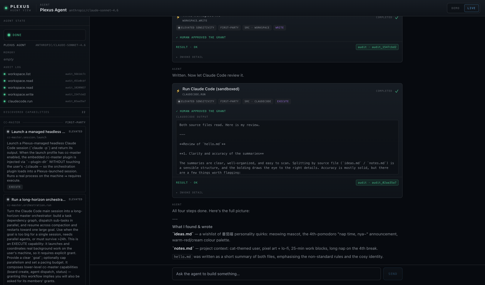
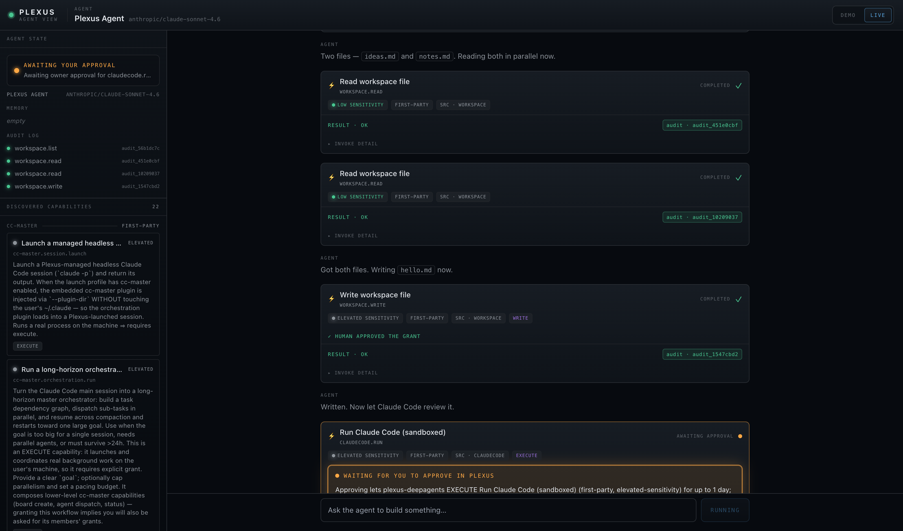
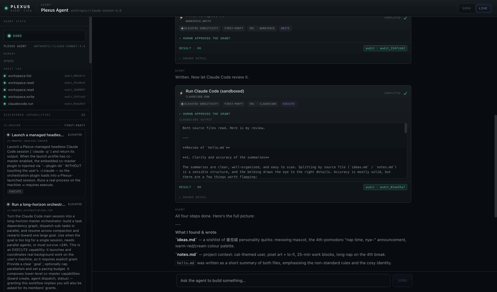
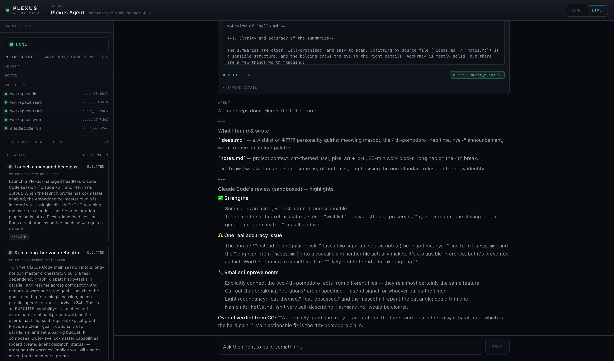

# Plexus Agent View — LIVE end-to-end run

This is a record of a **real, fully-live** run of the Agent View example: a real LLM
(driving a real DeepAgent), the real Plexus gateway, real resource-side human approval,
and real capability invocations — including a real **Claude Code** invocation that ran
sandbox-confined and reviewed a file the agent had just written.

Nothing in the lifecycle below is mocked. The agent discovered this machine's
capabilities over the wire, requested grants it could not self-approve, blocked while a
human-side approver decided, and then invoked workspace + Claude Code capabilities that
produced real, audited side effects.

- **Date:** 2026-06-30
- **Agent brain (model):** `anthropic/claude-sonnet-4.6`, routed via **OpenRouter**
  (`ChatOpenAI` → `https://openrouter.ai/api/v1`).
- **Gateway:** `plexus 0.7.0-rc.1`, loopback only, `http://127.0.0.1:7077`.
- **Backend (live mode):** `examples/agent-view/backend/server.py` on `:8800`
  (`AGENT_VIEW_MODE=live`), driving the real DeepAgent via `agent_runner.py`.
- **Web UI:** `examples/agent-view/web` (Vite) on `http://localhost:5180`, LIVE toggle.
- **Authorized workspace sandbox (the JAIL):** `/tmp/plexus-live-demo/` containing two
  seed files, `notes.md` and `ideas.md`.

---

## What the real agent did

The prompt sent through the LIVE UI:

> *"List the files in my workspace and read them. Then write a file named hello.md that
> gives a short summary of what they contain. Finally, have Claude Code review hello.md
> (sandboxed) and tell me its feedback."*

The agent (a 番茄喵 DeepAgent whose only reach onto the machine is Plexus capabilities)
ran this end to end:

| # | Capability     | Grant     | Approval                         | Audit id        | Result |
|---|----------------|-----------|----------------------------------|-----------------|--------|
| 1 | `workspace.list` | `read`    | auto-granted (read, first-party) | `audit_56b1dc7c` | OK — listed `ideas.md`, `notes.md` |
| 2 | `workspace.read` | `read`    | auto-granted                     | `audit_451e0cbf` | OK — read `ideas.md` |
| 3 | `workspace.read` | `read`    | auto-granted                     | `audit_10209037` | OK — read `notes.md` |
| 4 | `workspace.write`| `write`   | **PENDED → owner approved**      | `audit_1547cbd2` | OK — wrote `hello.md` |
| 5 | `claudecode.run` | `execute` | **PENDED → owner approved**      | `audit_02aa35a7` | OK — Claude Code reviewed `hello.md` sandboxed |

The two powerful steps (a write, and an execute that launches Claude Code) both
**deferred to the machine owner**. The agent could not self-authorize: it called the
capability once and blocked, polling the gateway, until the owner-side approver decided.
This is the whole point of Plexus, and here it is happening for real.

### The grants that pended and were approved (owner side)

The owner-side approver (the real human-in-the-loop, automated for this unattended run)
watched the connection-key-gated admin API `GET /admin/api/pending` and approved each
pending grant via `POST /admin/api/pending/:id {"action":"approve"}`:

```
PENDING grant id=pend_7775ff57…  caps=['workspace.write']  → APPROVED
PENDING grant id=pend_e9fe200d…  caps=['claudecode.run']   → APPROVED
```

(For the screenshots, the approver deliberately held each pending grant ~10s before
approving, so the live grant-pending GATE is clearly visible in the UI. The approval
itself is a genuine owner decision through the gated admin route.)

### What Claude Code actually ran and returned

`claudecode.run` launched a **real, headless Claude Code** kernel-confined by the
`cc-confine.sb` seatbelt profile to the JAIL (`/tmp/plexus-live-demo/`). It read all
three files inside the jail and produced a genuine critique of `hello.md`. Excerpt of
its real output (rendered in the tool-call card):

> *"Both source files read. Here is my review. … The summaries are clear,
> well-organized, and easy to scan. Splitting by source file (`ideas.md` / `notes.md`)
> is a sensible structure … The 4th-pomodoro rule is subtly overstated. `ideas.md` only
> says 'every 4th pomodoro the timer says nap time, nya~' … `hello.md` merges these into
> one claim — that the timer announces 'nap time, nya~' **instead of a regular break** …
> That framing is an inference, not something either source states."*

This is a real model reading real files in a real kernel sandbox and reasoning about
them — not a recording.

### The file the agent wrote (`/tmp/plexus-live-demo/hello.md`)

```markdown
# hello.md — Workspace Summary

## ideas.md
A wishlist of 番茄喵 (Pomodoro-Cat) personality quirks:
- A tomato-cat mascot that **meows** at the end of every focus block.
- A special rule for the 4th pomodoro: the timer announces **"nap time, nya~"** instead of a regular break.
- A cozy aesthetic with **warm reds and creams** as the colour palette.

## notes.md
Project context for the timer build:
- The user is cat-themed and loves **pixel art** and **lo-fi music**.
- Standard work blocks are **25 minutes**.
- The 4th break is a **long nap** — the key non-standard rule that makes this timer personal.
```

---

## Screenshots

### 1. Capabilities discovered (22) + completed run

The agent handshakes, pulls the full manifest, and the left rail lists **22 discovered
capabilities** across the host's sources (workspace, claudecode, codex, cc-master,
apple-calendar/reminders, things, obsidian). The header shows the live model
`anthropic/claude-sonnet-4.6` and the LIVE toggle.



### 2. The live human-approval GATE (the centerpiece)

`workspace.write` has already been approved (note **"✓ HUMAN APPROVED THE GRANT"** on
its card), and now `claudecode.run` is **AWAITING APPROVAL**. The amber gate carries the
gateway-authored narration:

> *"WAITING FOR YOU TO APPROVE IN PLEXUS — Approving lets plexus-deepagents EXECUTE Run
> Claude Code (sandboxed) (first-party, elevated-sensitivity) for up to 1 day; revoke
> anytime in Plexus → Grants. PENDING · CLAUDECODE.RUN — THE AGENT CANNOT
> SELF-AUTHORIZE."*

The agent is blocked and polling while this gate is shown. The left rail's AGENT STATE
reads **AWAITING YOUR APPROVAL**.



### 3. The same card resolved — real Claude Code output + audit id

After the owner approves, the `claudecode.run` card resolves to **COMPLETED**, shows the
real **CLAUDECODE OUTPUT** (the review text), **RESULT · OK**, and a real audit id
**`audit_02aa35a7`**. The left-rail AUDIT LOG now has all five entries, and AGENT STATE
is **DONE**.



### 4. Final completed transcript

The full transcript end to end: list → read → read → write (approved) → Claude Code
review (approved), then the agent's natural-language wrap-up of what it found, wrote, and
what Claude Code flagged.



> Note: there is no orchestration-DAG screenshot (the planned screenshot "d"). The
> orchestration board only renders when an `orchestration.board` event arrives, which
> happens for cc-master multi-agent orchestrations. This simple single-agent task never
> spawned one, so no DAG appeared. This is expected, not a failure.

---

## How to reproduce

All commands run from the repo root unless noted. The OpenRouter key is loaded into the
backend's environment from a file and **never printed**.

```bash
# 0. Authorized workspace sandbox (the JAIL) with a couple of seed files
mkdir -p /tmp/plexus-live-demo
printf '# Project Notes\n\n...\n' > /tmp/plexus-live-demo/notes.md
printf '# Ideas\n\n...\n'        > /tmp/plexus-live-demo/ideas.md

# 1. Boot the gateway, authorizing the workspace + claudecode/codex sandboxes to the JAIL.
#    (codex/cc headless launch is gated by these env vars; see "Caveats" re: codex.)
PLEXUS_WORKSPACE_DIR=/tmp/plexus-live-demo \
PLEXUS_CC_HEADLESS_LAUNCH=1     PLEXUS_CC_AUTHORIZED_DIR=/tmp/plexus-live-demo \
PLEXUS_CODEX_HEADLESS_LAUNCH=1  PLEXUS_CODEX_AUTHORIZED_DIR=/tmp/plexus-live-demo \
  bun run start
# Gateway: http://127.0.0.1:7077 ; connection-key at ~/.plexus/connection-key
# Verify:  curl -s http://127.0.0.1:7077/.well-known/plexus

# 2. Backend in LIVE mode (reuse the pomodoro-demo venv, which has the live deps).
#    Loads OPENROUTER_API_KEY from a private env file — value never echoed.
cd examples/agent-view/backend
set -a; source /path/to/private/or.env; set +a          # OPENROUTER_API_KEY=sk-or-… (masked)
export PLEXUS_CONNECTION_KEY=$(cat ~/.plexus/connection-key)
export PLEXUS_DEMO_MODEL=anthropic/claude-sonnet-4.6
export AGENT_VIEW_MODE=live PORT=8800 PLEXUS_BASE_URL=http://127.0.0.1:7077
../../pomodoro-demo/.venv/bin/python server.py
# Verify: curl -s http://127.0.0.1:8800/api/health  ->  {"ok": true, "mode": "live"}

# 3. Owner-side approver (the real human-in-the-loop, automated for an unattended run).
#    Polls GET /admin/api/pending and approves each via POST /admin/api/pending/:id.
APPROVE_HOLD_SECONDS=10 python3 auto_approver.py     # approve-only; never denies

# 4. Web UI (vite binds localhost; probe http://localhost:5180 not 127.0.0.1).
cd examples/agent-view/web
AGENT_VIEW_BACKEND=http://127.0.0.1:8800 bun run dev

# 5. Open http://localhost:5180, click LIVE, send the prompt above.
```

The auto-approver used for this run (`auto_approver.py`) is a ~40-line stdlib poller that
reads `~/.plexus/connection-key`, lists pending grants, and POSTs `{"action":"approve"}`
for each. Approve-only, logs every decision.

---

## Honest caveats — what's real vs. what was worked around

**Real (not simulated):**
- The LLM is real: `anthropic/claude-sonnet-4.6` over OpenRouter, driving a real DeepAgent
  (`create_deep_agent`) with Plexus capabilities compiled to `SKILL.md`.
- The gateway, handshake, manifest, capability discovery (22 caps), and the full
  grant→invoke→audit wire protocol are real.
- The owner approval is real: pending grants surfaced on the connection-key-gated admin
  API and were resolved via the real approve route. The agent genuinely could not
  self-approve and blocked while pending.
- `workspace.list/read/write` ran for real against the JAIL; `hello.md` is a real file the
  agent wrote.
- `claudecode.run` launched a **real headless Claude Code**, kernel-confined by
  `cc-confine.sb` to the JAIL, which read the files and produced a real review.

**Worked around / honest blockers:**

1. **Codex was BLOCKED on this machine (sandbox/runtime-home mismatch).** The prompt
   originally asked Codex to review the file. The codex source's seatbelt profile
   (`packages/runtime/src/sources/codex/sandbox/codex-confine.sb`) grants Codex read of
   `~/.codex`, but this machine's `codex` binary is the orca/cc-master-wrapped variant
   that resolves its config from `~/Library/Application Support/orca/codex-runtime-home/…`,
   which the kernel sandbox denies. The real errors observed in the UI were
   `[transport_error] … could not create PATH aliases: Operation not permitted` and
   `Failed to read config file …/codex-runtime-home/home/config.toml: Operation not
   permitted (os error 1)`. Codex genuinely **launched** (the sandbox is doing its job) but
   could not load its own runtime config. **Workaround:** the demo prompt was switched to
   **Claude Code** (the proven execute path on this machine), which exercises the identical
   pending→approve→execute→audit lifecycle. The codex path would need its sandbox profile
   to also grant the orca runtime-home; that is environment-specific and was left as-is.

2. **A real client bug was found and fixed during the run.** The Python protocol client
   (`examples/pomodoro-demo/plexus_deepagents/client.py`, reused by the live backend)
   double-appended the pending query when polling grant status: the gateway returns a
   complete `statusUrl` (`…/grants/status?pendingId=<id>`), and `_await_pending` appended
   `?pendingId=…` again, producing `…?pendingId=X?pendingId=X`. The gateway then parsed a
   bogus pendingId and returned `[unknown_capability] No pending grant 'X?pendingId=X'`,
   so **every** grant that actually pended failed its first poll. The fix: use the
   gateway's `statusUrl` as-is when it already carries the query, and only build the query
   ourselves on the bare-endpoint fallback. With this fix the pending→approve flow works
   exactly as designed (see screenshots 2–3). This was a genuine bug in the example's
   client, not a workaround.

3. **The live runner needed an OpenRouter routing fix.** `agent_runner.py` passed a bare
   model string to `create_deep_agent`, which would route to the Anthropic/OpenAI direct
   provider (needing that provider's own key) rather than OpenRouter. Added
   `_resolve_live_model()` mirroring `agent.build_agent`: when `OPENROUTER_API_KEY` is set,
   construct an explicit `ChatOpenAI` object pointed at OpenRouter. Without this the live
   backend would not use the provided key.

4. **Grants persist.** After approving `workspace.write` / `claudecode.run` once, those
   standing grants auto-cover later invokes, so a second run did not re-pend. To produce a
   clean pending-gate demo, the standing grants were revoked
   (`POST /admin/api/revoke {agentId, capabilityId}`) before the final captured run. This
   is normal Plexus behavior (a grant is a standing decision with a trust window), just
   worth knowing when reproducing.

5. **Edits made (not committed).** Per the run instructions nothing was committed. Two
   files were edited on branch `example/agent-view`:
   `examples/pomodoro-demo/plexus_deepagents/client.py` (the pending-poll URL fix) and
   `examples/agent-view/backend/agent_runner.py` (the OpenRouter model resolution).

**Security:** the OpenRouter API key was loaded into the backend environment from a
private, `chmod 600` env file and **never** written to any log, screenshot, this document,
or stdout. It was confirmed absent from all run logs and the example directory.
