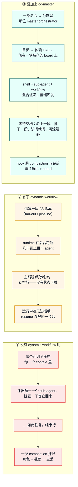

# cc-master

> For English, see [README.md](README.md)。


**把一个单会话装不下的大目标交给 Claude Code —— 让它自己指挥自己干到收尾。**


*实时 board 的可视化：每个任务是一个节点，每条依赖是一条连边——总指挥的整张计划图一眼尽收。*

一个长周期目标，不该在下一次 context compaction 时就这么死掉。你把两天的活交给 agent，它干出了真进展，上下文一满、一次 compaction 之后，它就忘了自己正在指挥——只剩*装着忙、却什么都没产出*。cc-master 就是那个不会忘的层。

它是一个「随处可用」（ship-anywhere）的 Claude Code 插件，把任意 main-session agent 变成长周期的 **master orchestrator（总指挥）**：把目标拆成依赖图、把后台工作并行派发、在每一个等待空档里让主线程**有产出地**持续推进，并熬过反复 compaction 与跨会话续接、全程不丢线索。它**不是一个 framework**——只是命令 + 3 个 skill + hooks + 一份 board 文件。

```
/cc-master:as-master-orchestrator <一个值得花 >24h 的目标>
```

这一条命令就会 bootstrap 一块持久的 board，并把当前 session 化身为总指挥。**从 clone 到跑起来，60 秒。** ↓ 往下看它相比裸 Claude Code 到底多给了你什么。

---

## 三种范式，并排一看便知

Dynamic workflows（随 Opus 4.8 一同发布）给了 Claude Code 真正的并行能力——一段脚本就能 fan out 出上百个 agent。但对一个**长周期**目标来说，仍有两处空白：官方模型只承诺主会话**保持响应**，从不承诺总指挥**保持产出**；也没有任何机制能把你的**角色与进度带过一次 compaction**。cc-master 填的正是这块空白——它不取代 dynamic workflow，而是把它*包了进来*。

下面是同一个长目标——*「把一个应用国际化到 6 种语言（locale）」*——三种跑法的对照：



第 ③ 列的每一条断言都锚在一个真实机制上，不是营销话术：

|  | ① 之前 | ② Dynamic workflows | ③ cc-master | ③ 靠什么兑现 |
|---|---|---|---|---|
| **并行度** | 一次一个 sub-agent | 几十到上百个 agent | shell + sub-agent + workflow 混合 | 三种后台手段 |
| **等待时的主线程** | 阻塞，或亲自上手 | 响应但空转 | 主观能动：验收 · 前瞻 · HITL · 沉淀 | 决策程序（Skill A） |
| **能否熬过 compaction** | 否 | 否 | **能**——角色 + board 被重注 | `reinject.sh`（SessionStart hook） |
| **跨会话续接** | 否 | 仅限同一会话 | **能**——靠 board 文件重新认回 | board（持久存档文件） |
| **端点验收** | 临时随手 | 写在脚本里 | 总指挥独立验收 | 镜头 6 + 决策程序（Skill A） |
| **配额感知** | 否 | 否 | **能**——账户权威 5h/**7d** `used_percentage`（从 status line 捕获；本地反推作 fallback） | `usage-pacing.js`（Stop hook）+ `statusline-capture.js` + `cc-usage.sh` |

---

## 0.9.0 新特性 —— 把图嵌套起来，把决策备成采访

0.9.0 让 board 本身更有深度、让 human-in-the-loop 更聪明：一个大到单张扁平任务表装不下的目标，现在可以拥有*嵌套*的调度子图；而每一个指挥抛回给你的决策，都以一份备好的采访抵达，而不是一个失了上下文的干问题。

### dag-in-dag —— 嵌套调度子图（max depth 1）

真实规模的目标塞不进一张扁平 `tasks[]`——你想按模块或阶段把它分组。0.9.0 让一个 **owner** 节点拥有一层子任务（一个子计划），而 cc-master 仍自己横向调度这些子节点——派发 / WIP / 端点验收 / watchdog 全照旧适用。它仍是**一张扁平 board 文件**：每个 task 仍 top-level 留在 `tasks[]`，嵌套靠一个新的关系字段 `tasks[].parent` 表达。两条正交的边各司其职——`deps`（调度：open、可指任意节点、上游一就绪就触发）与 `parent`（容器 / rollup：封装、一个子最多一个父）。`parent` 升入硬 narrow-waist（cc-master 史上最大的 hook 改动）；一个 `done` 的 owner 若子节点没全 done 会触发一条**非阻断**的 Stop-gate 软提醒，绝非硬拦。（见 [ADR-012](adrs/ADR-012-parent-waist-and-rollup-aware-stop-gate.md)。）

它配套一套**图分析库 + CLI**（`board-graph.js`，hook 也复用同一份）：机器算临界路径 / CPM（带诚实的 `weight_source` 标注——缺时间锚时只报结构、不报假小时数）、并行度（T₁/T∞）、impact（哪个节点 gating 最多下游）、ready 集、owner rollup——专为依赖图交错到心算靠不住时而备。

### 决策采访 —— 每个抛回给你的决策都备好了再来

当编排撞上一个只有人能拍的决策（`blocked_on:"user"`），你过去是被空投到一个失了上下文的决策点。0.9.0 把它变成一场**备好的采访**。趁着 idle，指挥在那个节点上挂一份自说明的 `decision_package`（叙事上下文、在问什么、要什么——决策 / 建议 / 方案——以及候选项各自的权衡）。`/cc-master:view` 把它渲成一张**富决策卡**，带一键复制入口命令。你在一个独立、满血的 session 里跑 **`/cc-master:discuss <node-id>`**：它载入采访包、做**时效性校验**（上游在备好之后变了就先 re-ground），陪你把决策谈透，再把结论写成一份 sidecar——绝不写 board。指挥在下一次 recon 时消化那份 sidecar、据此重规划。你的时间和指挥的时间彻底解耦——而且因为是一个独立 session 承载讨论，「指挥永不演奏」这条红线变得*更强*、而非更弱。

---

## 0.8.0 新特性 —— 撞上配额墙也照样编排到底

一个长周期任务，不会因为你撞上配额上限就不再「长」。0.8.0 补上了让运行跨越单个账号 5h/7d 窗口的那块拼图——并配上让它落得干净的安全号池与双侧 pacing。

### 无重启换号 —— 不重启、不丢状态

编排跑到一半，你撞上 5h 或 7d 配额墙。0.8.0 之前，这一撞就是整轮的终点。现在 cc-master 能把你切到一个备用号——**不重启 session、也不丢任何编排状态**：board、在飞任务、整张计划都原封不动留在原处。*运行中*的 Claude Code 进程会惰性 re-read 新凭证、无缝接管新号的配额——像 Orca 的换号那样无缝，但**原生于 cc-master、由总指挥自己的 pacing 判断驱动**，而不是一个你得记着去手动调用的另一个工具。

机制一句话：换号覆写官方共享凭证的三个存储 → 运行中的 `claude` 在 access token 临近过期时惰性 re-read 它们 → 新号接管。**不 `exec`、不重启进程、不 `--resume`**——session 全程不眨眼。

> 这一条经真账号端到端验证过：换号之后，报出来的配额 `%` 并不归零——而是翻成*切入号*的真实用量，证明运行中的进程真的采纳了新凭证。

### 安全的备号池 —— `/cc-master:accounts`

换号得有个「切到哪」。`/cc-master:accounts` 管理一个 **token-blind** 的备号池（`--add` / `--delete` / `--refresh` / `--list`）。你的 OAuth token **只**活在 OS keychain（macOS）或 `0600` 文件（其余环境）里；号池 registry 只存**非密指针**——`email → vault 引用` + 到期日 + 身份——token **绝不**进 agent context / log / registry。录一个号一条命令（登录到目标号，再 `--add`），还带一道**身份 guard** 拒绝把错号的凭证错标成另一个号。

### 双侧 pacing 走廊

cc-master 把你的 token 烧速对着滚动的 5h/7d 配额窗口从*两侧* pace：临近一面墙时**减速**、有余量且临近 reset 时**加速**——既不半截撞墙、也不让配额白白蒸发掉。7d 窗口是加速的硬上限。（见 [ADR-010](adrs/ADR-010-two-sided-pacing-corridor.md)。）

> 想要建池 / 管池的实操指南？见下文 [管理一个备号池 —— 怎么添加账号](#管理一个备号池--怎么添加账号)。

---

## 跟着跑一遍，从头到尾

理解 cc-master 最快的办法，是看一场编排怎么发生——而且看它一口气调动好几样能力。一个真实长目标进去，一块持久的 board、按难度分档的并行 worker、一个抛回给*你*的决策、一次临场 escalation、配额感知的 pacing、一个独立验收过的收尾出来。下面每一段 board JSON 都是磁盘上那份文件的**真实快照**——正是 hook 在决定「你能不能停」时读的那一份。

> **这个目标：** *把 web app 国际化到 6 个 locale——搭起 i18n 框架、抽取所有硬编码字符串、逐 locale 翻译、上线 locale 路由。* ——形态正是真实长任务的样子：一个共享地基，然后一堆想并行跑的独立 per-locale 工作，外加一个只有人能拍的板。

**第 1 拍 —— 一条命令建好 board。** `UserPromptSubmit` 看到命令体里的 sentinel，跑 `bootstrap-board.sh`，它在*agent 动手之前*就把 board 文件建好、把路径递回来：*「a fresh orchestration board was created at `<home>/…board.json` … 把目标拆成依赖 DAG、写 `tasks[]` … 然后跑决策程序。」* bootstrap 不指望 agent 记得维护状态——它直接递一块过去。

**第 2 拍 —— 拆图、给模型分档、把该你拍的抛出来。** 总指挥把目标拆成 DAG：一个万物依赖的临界根 `T0`（搭 i18n 框架 + 抽字符串）跑**强模型**，三个独立 locale 叶子 `de` / `ja` / `ar` 跑**廉价模型**（临界链上用强、float 上用廉）。有个决定不该总指挥替你做——*产品术语是翻译还是保留英文？正式还是非正式语气？*——于是它落成一个 `blocked_on:"user"` 节点，**立刻**抛给你，与其余一切并行。

```json
// INITIAL —— 根在飞；locale 叶子 blocked 等它；一个决策抛回给你
{
  "schema": "cc-master/v1",
  "goal": "Internationalize the app to 6 locales (i18n framework + per-locale translation + locale routing)",
  "owner": { "active": true, "session_id": "smoke-session-001", "heartbeat": "2026-06-08T10:00Z" },
  "git": { "worktree": "/repo/.worktrees/i18n", "branch": "feat/i18n-rollout" },
  "wip_limit": 4,
  "tasks": [
    { "id": "T0", "status": "in_flight", "deps": [], "model": "opus", "title": "i18n framework + string extraction" },
    { "id": "de", "status": "blocked", "deps": ["T0"], "blocked_on": "T0", "model": "haiku", "title": "translate locale: de" },
    { "id": "ja", "status": "blocked", "deps": ["T0"], "blocked_on": "T0", "model": "haiku", "title": "translate locale: ja" },
    { "id": "ar", "status": "blocked", "deps": ["T0"], "blocked_on": "T0", "title": "translate locale: ar (RTL)" },
    // blocked_on:"user" 节点带一份 decision_package —— /cc-master:discuss 打开的「备好的采访」
    { "id": "D1", "status": "blocked", "deps": [], "blocked_on": "user", "title": "glossary + register decision",
      "decision_package": {
        "prepared_at": "2026-06-08T10:05Z", "freshness": "fresh", "ask_type": "decision",
        "inputs_hash": "sha256:3e7c1a9f4b08d62e5a0c7f1b9d4e8a26c0f3b7d519e6a2c84f0b1d7e93a5c6f2",
        "context_md": "翻译 UI 时冒出一个产品术语取舍：品牌 / 产品术语是本地化还是保留英文？对用户用正式还是非正式语气？这定下全部 6 个 locale 的基调——是个产品决策，不该我替你拍。",
        "question": "产品术语翻译还是保留英文？正式还是非正式语气？",
        "what_i_need": "给一个术语表策略 + 一个语气档；我会把它当翻译约束下发给每个 locale 叶子。",
        "why_it_matters": "每个 locale 叶子（de/ja/ar/…）都依赖这条约定。拍晚了得返工重译；现在拍板能让所有叶子并行地按同一条规则跑。",
        "options": [
          { "id": "opt-keep-en", "label": "产品术语保留英文，非正式语气", "rationale": "跨 locale 品牌一致；非正式贴合 app 的嗓音。", "tradeoffs": "✅ 术语零漂移。⚠️ 部分 locale 期望本地化术语。" },
          { "id": "opt-localize", "label": "本地化产品术语，按各 locale 习惯用正式语气", "rationale": "每个市场读起来都地道。", "tradeoffs": "✅ 各 locale 最自然。⚠️ 要维护术语表；ar/ja 语气规范不同。" }
        ],
        "enter_cmd": "/cc-master:discuss D1 --board <board-stem>"
      } }
  ]
}
```

**第 3 拍 —— 熬过一次 compaction（最难的一环）。** 长任务意味着上下文会被填满、compaction 会*整个*抹掉「我是总指挥」这件事——而 agent 没法替自己重注它，因为「它曾有个角色」这份记忆正是被抹掉的那份。`SessionStart`（含 `source:compact`）时，`reinject.sh` 从 context **之外**重注：*「You are a cc-master master orchestrator. 你的 board 在 `<home>` … 按 goal 认回它 … 别重做已完成/已验收的活，先整合已完成的后台结果。」* board 带过了*进度*，hook 带过了*身份*。

**第 4 拍 —— 就绪即发，且随机应变。** `T0` 落地、在端点被验收（总指挥亲读 diff——green gate *不算*通过）。locale 叶子 `blocked → ready`，在 `wip_limit: 4` 下并行派发。然后计划撞上现实：`ar` 不只是翻译——右到左（RTL）排版要真功夫——于是总指挥把它 **escalate 成一个 `workflow`** 并重规划，而不是硬塞一个不再合身的叶子。与此同时 `usage-pacing.js` 察觉这轮已逼近 5h 配额墙，注入一条**非阻断**轻推；总指挥就此节流——降 WIP、推迟优先级最低的 locale——而非顶满硬撞。万一它想在 board 还剩 `ready` 活时收尾，`verify-board.sh` 当场拦死：*「这块 board 还有 `ready` 任务……停之前先把它处理掉。」*

**第 5 拍 —— 独立验收，再一道强制自检。** 叶子跑完、各自独立验收（总指挥亲验渲染出的 locale，不信 worker 的自报）。board *看着*完成了——于是 agent 想停。**全篇最重要的 hook 时刻：** goal-hook 不会凭「done」就放行。在完成态的第一次停，它 block 一次、逼一道对照*原始 goal* 的自检——并点出你那个术语表决策**仍未答**：*「(1) 每个需要用户拍板的点都 surface / 标 `blocked_on:"user"` 了吗？(2) 对照原始 goal，每件 to-do 真的都做完了吗？」* 只要还欠你一个决策，「done」就被拒。

```json
// DONE —— 每个工作节点已验收；那个用户决策已答并落实
{
  "schema": "cc-master/v1",
  "goal": "Internationalize the app to 6 locales (i18n framework + per-locale translation + locale routing)",
  "owner": { "active": true, "session_id": "smoke-session-001", "heartbeat": "2026-06-08T12:30Z" },
  "wip_limit": 4,
  "tasks": [
    { "id": "T0", "status": "done", "deps": [], "verified": true },
    { "id": "de", "status": "done", "deps": ["T0"], "verified": true },
    { "id": "ja", "status": "done", "deps": ["T0"], "verified": true },
    { "id": "ar", "status": "done", "deps": ["T0"], "mechanism": "workflow", "verified": true },
    { "id": "D1", "status": "done", "deps": [], "title": "glossary + register decision (answered)" }
  ]
}
```

**想要可跑的证明？** 这里叙述的 hook 链——bootstrap、reinject，以及每一个 `verify-board` 的 block/allow 决策——都被 `smoke.sh` 端到端跑过一遍（这三个都是 bash hook，故 smoke 本身无需 jq、node 或网络），它逐步打印*发生了什么*和*hook 决定了什么*，外加 PASS/FAIL 退出码（兼作 CI 冒烟检查）：

```bash
bash examples/sample-orchestration/smoke.sh
```

完整逐步走查、连每一张 board 快照，都在 [`examples/sample-orchestration/walkthrough.md`](examples/sample-orchestration/walkthrough.md)。

---

## Quickstart

有两种受支持的跑法，按你的工作方式选——两条路径都只需 **Node 22+** 与 **bash**，别无他求。

### A. `--plugin-dir` —— 推荐（dev / dogfood）

让 Claude Code 直接指向一个 live 的 clone。对仓库的改动会在下一个 session 即时生效——**没有 cache、不用拷贝**。维护者本人就是这么跑的。

```bash
git clone https://github.com/nemori-ai/cc-master.git
cd cc-master
claude --plugin-dir .          # 本 session 从 live 仓库加载插件
```

`claude --plugin-dir /abs/path/to/cc-master` 在任何地方都能用，所以你可以在**另一个**项目里 dogfood cc-master。

### B. Marketplace + `enabledPlugins`（team / 稳定版）

先把这个仓库加为 marketplace，再在 settings 里启用插件。要在团队里共享同一个固定版本时，这是对的选择。**取舍：** enabled 的插件会被拷进 Claude Code 的 plugin cache，所以对你 clone 的 live 改动**不**会生效——想吃到改动必须 `claude plugin update`。

```bash
# 把本仓库加为 marketplace（URL、本地路径、GitHub repo 三种来源都行）
claude plugin marketplace add nemori-ai/cc-master
claude plugin install cc-master@cc-master
```

或者在 settings 里声明式启用。`enabledPlugins` 的值是一个以 `<plugin>@<marketplace>` 为键的**对象**（不是数组）：

```jsonc
// ~/.claude/settings.json
{
  "enabledPlugins": {
    "cc-master@cc-master": true
  }
}
```

> 一句话判断：在迭代插件本身 → `--plugin-dir`（live）。给团队钉一个版本 → marketplace + `enabledPlugins`（cached）。

加载后，给它一个值得它出手的目标（量级上 >24h、含许多可独立推进的单元）。完整命令集：

```
/cc-master:as-master-orchestrator <目标>            # bootstrap 一块 board，并就此化身总指挥
/cc-master:as-master-orchestrator --resume [选择器]  # 在新 session 里接续一块已存在的 board（见下）
/cc-master:status                                   # 渲染 board 摘要（board view）+ 校验「窄腰」契约
/cc-master:view                                     # 在浏览器里打开只读的 board DAG 可视化（webview）
/cc-master:discuss <node-id>                        # 把指挥抛回给你的决策谈清楚（见下）
/cc-master:handoff-to-new-session                   # 把 board 优雅交接给一个新 session（--resume 的写侧）
/cc-master:accounts --add|--delete|--refresh <email> | --list   # 管理无重启换号的备号池
/cc-master:stop                                     # 归档 board 并收尾（board 保留，不删除）
```

### 看一眼 board —— 速览或一张活的 DAG

两种只读的方式看编排进展，随时跑都安全（都不写 board）：

- **`/cc-master:status`** 在终端渲一份**可扫读的 board view**——按状态分组的 DAG（总进度、什么在飞、什么被阻塞、以及**等你拍板的决策**被显著抛出来），外加临界路径估计（指挥自己的心算，而非机器算的 CPM）与一道「窄腰」健康速检。
- **`/cc-master:view`** 在浏览器里起一个**本地、只读的 webview**。它拉起一个零依赖的本地 `node` http server，用 [xyflow](https://xyflow.com) 把 board 渲成画面，并**每 2s 活轮询**（不用手动刷新——board 一变画面自动更新）。顶栏有一个**三路开关——⬡ GRAPH（可视依赖 DAG）· ▦ BOARD（看板卡片视图：按状态分泳道的中密度卡片）· ☰ LIST（按状态分组的列表）**——外加一个 ☀ / ☾ 日夜主题切换；你的选择都跨刷新持久保留。BOARD 与 LIST 是 `/cc-master:status` 的网页等价物（AWAITING-YOU / READY / IN FLIGHT / BLOCKED / DONE·VERIFIED / NEEDS-ATTENTION 泳道，每张卡带同样的分析 chip 与点击打开的详情侧栏）。设计是「Mission Control」遥测美学：状态节点化作仪表灯、一条琥珀色临界路径脊柱、以及对 `blocked_on:user` 闸门的显著告警。所有资产（React / xyflow / dagre + 字体）都**本地 vendored**，故完全离线可用——零 CDN——守住 ship-anywhere 承诺。要停掉它，杀掉那个后台 shell（或它会随 session 结束而退出）。

DAG 依赖图（hero）、看板卡片、按状态分组的列表——全都活轮询、全都离线：


*⬡ GRAPH —— 依赖 DAG，「Mission Control」深色遥测。*


*▦ BOARD —— 看板卡片视图：按状态分泳道的中密度卡片。*


*☀ 同一个 BOARD 的日间模式 —— 用 ☀ / ☾ 切换主题。*


*☰ LIST —— 按状态分组的行，`/cc-master:status` 的网页孪生。*

### 把指挥抛回给你的决策谈清楚

当编排撞上一个只有人能拍的决策，它不会甩一个干问题给你。趁着 idle，它会在那个 `blocked_on:"user"` 节点上预先备好一份自说明的**决策包（decision package）**——它怎么走到这一步、到底在问什么、是要*决策 / 建议 / 方案*、以及候选项各自的权衡。在 `/cc-master:view` 里，那张 awaiting-you 卡片就升级成一张**富决策卡**，底部一个一键**复制 `/cc-master:discuss <node-id>`** 的按钮。

把命令粘进一个独立、满血的终端 session，你就能*在方便时、对着准确且仍有时效的完整依据*把这个决策谈清楚——discuss session **进入时会重新核对时效性**，若问题在期间又跑了的活下被架空就先 re-ground，再帮你判断（它能翻代码、翻 board）。谈完它把结论写成一份**版本化、append-only** 的 `<board-stem>--<node-id>--<STAMP>.decision.md` sidecar——要点摘要 + 完整决策文档——指挥在下一次 idle/recon 时拾取它（聊过不止一次就读**最新**那份）来重规划、清掉这道闸。没有实时通知、谁都不打断谁：人类的注意力，被重新分配到了刀刃上。

而且**讨论完即使指挥还没消化，卡片也能立刻看到痕迹**。谈过一次后，该节点在 `/cc-master:view` 的卡片上就显示 **💬 已讨论 N 次** + 最近一次结论的 TL;DR，可逐次展开（直接从 sidecar 读，经一条只读 `/decisions.json` 路由——viewer 仍零联网零 POST）。下次再点进来你一眼就知道*这个决策聊过没、聊了几次、聊出啥*——不用等指挥下一拍 recon。

```
/cc-master:discuss <node-id>   # 在一个新 session 里跑 —— 确切命令从 /cc-master:view 的决策卡上复制
                               # （复制出的命令默认带 --board <board-stem>，新 session 即便同 home 下还开着别的 orchestration 也绝不窜板）
```

### 在新 session 里接续一块已存在的 board

一个长程编排会比任何单个 session 活得更久。当原 session 关掉 / 崩了 / 你换了机器——或者你跑过 `/cc-master:stop` 又反悔了——`--resume` 让一个**全新 session 接管一块已存在的 board**，而不必从头重拆：

```
/cc-master:as-master-orchestrator --resume                 # 只有一块可续板 → 直接接；否则列候选让你挑
/cc-master:as-master-orchestrator --resume i18n            # 按 goal 子串 / 板文件名 / 时间戳前缀选板
/cc-master:as-master-orchestrator --resume i18n --force-takeover   # 确认接管一块看起来仍活着的板
```

- **任意板都可续**——既含仍 `active`（被遗弃）的板，也含 `/stop` **归档**的板。续一块归档板会**复活**它（`active:false → true`）。`/stop` 是一次**可逆的归档**而非永久终态；board 文件、它的 `tasks`、`log`、`goal` 在归档 → 复活之间全部保留。
- **接管默认安全。** 重盖 board 即把它交给新 session、令旧 session 的后台工作成孤儿——所以一块板若**看起来仍活着**（heartbeat / 文件 mtime 新鲜），`--resume` 会先警告并**暂不接管**，直到你带 `--force-takeover` 重发。选择器歧义 / 缺失 → 不写盘，列出候选（分为*被遗弃*与*将被复活*两组）请你挑定。
- **接续 = 接手，不是重启。** 指挥 reconcile 现有 `tasks[]` 而非重拆 goal，并把旧 session 留下的任何 `in_flight` 任务当孤儿——在端点验收它的产物（验过就标 done）或重新派发拿新 handle，绝不对着一个死掉的 handle 干等。详见 [ADR-009](adrs/ADR-009-resume-cross-session-re-arm.md)。

### 在 session 结束前优雅交接一块 board

`--resume` 是跨会话续接的*读*侧；`/cc-master:handoff-to-new-session` 是*写*侧。它由**旧** orchestrator session 运行，优雅地为一个**新** session 准备好 board——而不是丢下一块被遗弃的 board 等 `--resume` 事后发现：

```
/cc-master:handoff-to-new-session   # 在旧 session 里运行，准备一次干净的交接
```

指挥会：(1) 停止派发新活；(2) 让在飞任务在当前 session 跑完并验收（长跑掉队的兜底降级成孤儿 + 重验、surface 给你）；(3) 写一份**叙事层**交接文档——cc-master home 里的 sidecar 文件，指向 board、讲清*来龙去脉*而**不复述**它的 DAG；(4) 在 `board.log` 加一条指向该文档的指针；(5) 归档 board（`owner.active:false`），让下一个 session 的 `--resume` 无摩擦复活它；(6) 把文档路径和接下来要跑的确切 `--resume` 命令告诉你。handoff（准备）与 `--resume`（接管）是同一次干净跨会话接力的两半。

### 可选 —— 打开账户权威的配额感知

cc-master 能对照你订阅的**真实** 5h/7d 配额 `used_percentage` 来 pace——但这个信号**只**出现在 status line 脚本的 stdin 里（任何 hook / CLI / 文件都够不到）。要捕获它，得把 `statusline-capture.js` 接进你的 status line。别去手改 `settings.json`——**最 AI-native 的做法**是把下面这段 instruction 贴给 Claude Code，让它替你接线（它会定位真实安装路径、用 `--passthrough` 保住你已有的 status line、用绝对路径绕开「`${CLAUDE_PLUGIN_ROOT}` 在 `statusLine.command` 里是否展开」这个未文档化问题、并验证 sidecar 真落了盘）：

> 帮我启用 cc-master 的账户权威用量 pacing。我订阅的 5h/7d 配额 `used_percentage` 只出现在 **status line** 脚本的 stdin 里；cc-master 提供了 `statusline-capture.js` 把它捕获到一个 sidecar（`~/.claude/.cc-master-rate-limits.json`），供它的 pacing hook 和 `cc-usage.sh` 读取。请：
> 1. 定位 `statusline-capture.js` 的真实绝对路径——它在插件的 `skills/orchestrating-to-completion/scripts/` 下；插件可能装在 `~/.claude/plugins/cache/.../` 某个版本目录，或通过 `--plugin-dir` 指向本地 repo，用 `find`/`ls` 把真实路径找出来。
> 2. 读我现有的 `~/.claude/settings.json` 里的 `statusLine.command`（如果有）。
> 3. 把 `statusLine.command` 改成先跑 `statusline-capture.js`、再用 `--passthrough` 透传我原本的命令，这样我的状态行显示不变。用**绝对路径**（这个字段的变量展开官方未文档化）。把确切的改动 diff 给我看、我确认后再写。
> 4. 改完后让 status line 渲染一次（我会发条消息），检查 `~/.claude/.cc-master-rate-limits.json` 有没有按正确结构落盘，再跑一次插件的 `cc-usage.sh` 确认它的 `source` 是 `"account"`（不是 `local-derived-approx`）。
> 5. 如果我是 Pro/Max 但 `rate_limits` 一直没出现，告诉我为什么（它只在首次 API 响应后出现、且仅 Pro/Max）。

不接也能用——pacing 会静默退回本地 JSONL **反推**，那是个 reset 倒计时可能差一个数量级的近似（[Finding #37](design_docs/dogfood-findings.md)）。仅 Pro/Max 订阅有此信号；其余环境此步是 no-op、由 fallback 兜底。

### 管理一个备号池 —— 怎么添加账号

无重启换号（见上）需要一个备号池作为「切到哪」。`/cc-master:accounts` 就是你建池、管池的入口。agent 替你跑预设脚本，但**你的 token 全程不经过它**——token 只活在脚本子进程与 OS keychain / `0600` 文件里。（云后端不适用——Bedrock/Vertex/Foundry 没有订阅 OAuth token 可管。）

**录一个号 —— `/cc-master:accounts --add <email>`**

- **机制 = keychain 直读。** 脚本从 macOS keychain **直读你当前登录号的完整 OAuth 凭证 blob** 存进号池。不弹浏览器、不 `setup-token`——它只*读*、绝不*写*你的官方凭证，所以**你当前的登录原封不动**。
- **唯一前提：你当前必须正登录在目标号。** 先用 **Orca app** 或 `claude` 的 `/login` 登录到号 X，*再*跑 `/cc-master:accounts --add X`。
- **身份 guard。** 脚本会校验*你当前登录的 email* == *你给的 `--email`*，不符就**立即 FAIL**——这样号 B 的凭证绝不会被错标成号 A。
- **建多号池：** 登录 A → `--add A`；切登录到 B → `--add B`；逐个来，每号录一次。
- **其它操作：** `--list`（看号池——每号的 vault 形态 / 到期 / active / 可否切入），`--delete <email>`，`--refresh <email>`（= 重录，与 `--add` 等价）。

**注意事项（血泪经验）：**

1. **必须是真 `/login`（完整 OAuth），不能是 `claude setup-token`。** 只有真登录才在 keychain 写下**非空 `refreshToken`**——而无重启换号**死依赖 `refreshToken`** 续期（keychain 里的 access token 仅 ~8h 有效）。`setup-token` 不产生 `refreshToken`，切进去的号续不上、很快就挂。若 `--add` 报「未能取到含非空 refreshToken 的完整 blob」，就是你没真正 `/login`——用 Orca / `claude /login` 走完整登录后重跑。
2. **换号覆写的是你的全局登录。** 本机所有 `claude` session 会**一起**切到新号（这是有意为之——让跨 session 的 pacing 准）。可逆：随时切回号池里任一号。
3. **token-blind，端到端。** 你的 OAuth token 全程只在脚本子进程 + OS keychain / `0600` 文件里——绝不进 agent 的 context / transcript / log，也绝不进号池 registry（只存非密指针）。
4. **凭证会过期 —— 失效就重录。** 某号的存档凭证过期或失效（久未用、或旧版本录的），重新登录它 + `--add` 再录一次即可。
5. **`switchable: no`**（在 `--list` 里）= 该号还没有可用 token（已登记但需录入才能被切入）。
6. **云后端不适用**（Bedrock/Vertex/Foundry 没有订阅 OAuth token 可管）。

> **换号到底怎么工作（心智模型）：** 从号池读目标号的 blob → 用它的 `refreshToken` force-refresh 出新鲜 token → 覆写官方凭证存储 → 运行中的 `claude` 惰性 re-read 并接管——不重启、不 `--resume`。

---

## 六愿景 charter（C1–C6）

cc-master **致力于让** Claude Code agent 化身一个具备六项能力的 master orchestrator。这些是**指导设计的方向目标，而非「六条已全部兑现」的声称**——状态列对「今天已落地 vs 仍是 design-only」保持诚实：

| # | 能力 | 状态 | 今天怎么兑现 |
|---|---|---|---|
| **C1** | 异步并行多线程推进、把目标完整落地——不是干到一半，而是一路到底 | 🟢 Live | 三种后台手段 + 决策程序 loop + `Stop` 门强制「真的全做完」 |
| **C2** | 控制 token 消耗*速度*——往双侧走廊里收，既不顶满也不欠用 | 🟢 Live | `usage-pacing.js`（对账户 5h/**7d** `used_percentage` 出**双侧**非阻断警告：临近上限轻推节流 *且* 5h 窗口欠用时轻推加速，并以 7d 窗口作硬上限——见 [ADR-010](adrs/ADR-010-two-sided-pacing-corridor.md)；经 `statusline-capture.js` 捕获，本地反推 fallback）+ `cc-usage.sh`（带外查询，account 优先） |
| **C3** | 把握自主决策与寻求人类接入的边界 | 🟢 Live | 红线 + `blocked_on:user` 节点 + `Stop` 门列出未答用户决策 |
| **C4** | 边学边分解、管理、更新、重规划目标 | 🟢 Live | board DAG + CPM 拆解 + resume 报出悬挂的 `stale`/`escalated` 节点 |
| **C5** | 在合理燃烧速率*之下*最大化吞吐 | 🟢 Live | WIP cap（~75% 利用率）+ 免费 float 并行 + `posttool-batch.sh` 软警告 |
| **C6** | 按复杂度、难度、时长选对模型 | 🟡 Partial | **复杂度/难度**维已落地（per-node `agent({model})` 选档）；**时长**维仍 design-only |

> 🟢 Live · 🟡 Partial · ⚪ Design-only。哪些能力已落地 vs design-only 由 [`design_docs/vision-landing-tracker.md`](design_docs/vision-landing-tracker.md) 度量；完整 charter 的单一真相源在 [`design_docs/spec.md` §1.0](design_docs/spec.md)。

---

## 工作原理

这个插件 = **命令 + 3 个 skill + hooks + 一份 board 文件**，每件各有各的寿命：

```
cc-master/
├── .claude-plugin/
│   ├── plugin.json                     清单（manifest）
│   └── marketplace.json                marketplace 条目（安装方案 B）
├── commands/
│   ├── as-master-orchestrator.md       bootstrap —— 化身总指挥
│   ├── status.md                       汇总 board 进度 / 健康度（board view）
│   ├── view.md                         起一个只读的 board DAG 可视化 webview
│   ├── handoff-to-new-session.md       为一个新 session 准备干净交接
│   ├── accounts.md                     管理换号号池（录入 / 删除 / 续期 / 列表）
│   └── stop.md                         归档 / 置 board 非活跃
├── skills/
│   ├── orchestrating-to-completion/    Skill A —— 编排方法论（魂在这）
│   ├── authoring-workflows/            Skill B —— 怎么写 workflow 脚本
│   └── account-management/             Skill C —— 换号号池机制层（选号 / 切号 / vault）
└── hooks/
    └── scripts/{bootstrap-board, reinject, verify-board,    bash
                 posttool-batch}.sh +
                 usage-pacing.js                             node
```

- **命令**是一次性开机引导——你主动触发，它把「我是 master orchestrator」的哲学与操作纪律灌进来，并开好 board。
- **skill** 是按需调阅的深度手册——跑编排循环时翻 Skill A，写 workflow 脚本时翻 Skill B，管换号号池时翻 Skill C（`account-management`：建号池 registry、选最优切入号、token 只进 vault）。
- **hook** 是总指挥的运行时——它熬过 compaction（重注「你是总指挥 + 这是你的 board」）、把关收尾、对过度派发软警告、对照账户 5h/7d `used_percentage` 感知配额墙（由 `statusline-capture.js` 从 status line 捕获；本地反推作 fallback）。只在结构化 JSON 解析划算处（算 usage / rate-limit JSON）才用 `node`，其余一律 bash（[ADR-006](adrs/ADR-006-hooks-may-use-node-js.md)）。

### 它教的三种后台手段

cc-master 教总指挥用三种「随处可用」的可靠手段来推进主线程：

1. **后台 shell** —— 长跑命令以 detached 方式启动，主线程照常前进。
2. **Sub-agent（`run_in_background`）** —— 一个独立、终结性的推理任务，完成后整合回来。
3. **Workflow** —— dynamic-workflow 脚本（fan-out / pipeline / loop），做结构化的并行编排。

在这三者之上，再叠一张 **watchdog 自我唤醒**安全网，补 harness 补不到的那个盲区：harness 会在后台任务*完成*时自动重唤起主线，但任务若 hang 死、静默死、或压根没真派出（幽灵任务），就不会有完成事件触发。所以在一次合法等待之前、若还有 in_flight 后台任务悬着，总指挥会 arm 一个定时唤醒，间隔回来对账地面真相。它的机制按可用性降级：本地 `CronCreate` / `ScheduleWakeup` 定时器优先，缺则用 `Monitor` 守 liveness 信号，再缺则落到 universal 的 background-shell `until` 兜底（ADR-011）。

它**有意不用** **agent-teams** 和**云端 scheduled routines**：两者都不够「随处可用」（前者藏在实验开关后面，后者需要 claude.ai 账户、且在 Bedrock/Vertex/Foundry 上不可用），因此被设计性地排除在外。watchdog 用的本地 `ScheduleWakeup` / `CronCreate` 定时器是个 in-session、免 OAuth 的例外——它们不破 ship-anywhere（ADR-011）。

### Bootstrap 与收尾，由 hook 担保

board 是否存在，**不依赖 agent 听不听话**；总指挥也无法偷偷提前撂挑子。五个 hook，横跨四个事件：

1. **`UserPromptSubmit`**（`bootstrap-board.sh`）检测到命令体里的 sentinel → 确定性地建好一个空 board 骨架 + 把其确切路径和总指挥角色注入进来。这也是**武装动作**（见下）——带 `--resume` 时则改为给一块**已存在**的 board 重新武装（第二种 ARM 形态：把 owner 盖到选定的旧板上，归档板则一并复活；[ADR-009](adrs/ADR-009-resume-cross-session-re-arm.md)）。
2. **`SessionStart`**（`reinject.sh`）在每次 compaction 后、以及 resume 时重注角色 + board——resume 时还会**报出上一轮 plan 更新未对账遗留的 `stale`/`escalated` 悬挂节点**。
3. **`Stop`**（`verify-board.sh`）对**本 session** 的 active board 跑一道纯 bash 的门（按 `owner.session_id` 过滤，所以并发编排互不干扰）。board 为空、或还剩 `ready`/`uncertain` 的活，就 **block** 住这次 Stop；当 board 看起来完成了，它会逼一次对照 goal 的**自检**——并**列出未答的 `blocked_on:user` 决策**——才放行；还有一道 fuse（连续 block 5 次）兜底，防止误判把 agent 永久焊死。
4. **`Stop`** 上还跑 `usage-pacing.js`（node）：优先用 `statusline-capture.js` 捕获到 sidecar 的**账户权威** 5h/7d `used_percentage`（sidecar 缺位时退回本地 JSONL 反推），注入**非阻断**的 pacing 警告——**双侧**：任一窗口临近上限时轻推**节流**，5h 窗口被欠用时轻推**加速**（免得配额白白蒸发），并以 7d 窗口作加速的硬上限。它绝不 block，也绝不替你决定**怎么 pace**（那是总指挥的判断）。
5. **`PostToolBatch`**（`posttool-batch.sh`）在一批并行调用后，数 in_flight 任务对 board 的 `wip_limit`，过度派发时**软警告**——绝不 block，并行自由照旧。

**每个 hook 未武装即休眠。**「武装」由磁盘上的 board 派生：hook 只在**本 session 拥有一块 active board**时才动作（`owner.active:true` **且** `owner.session_id` == hook stdin 的 `session_id`；sid 为空则降级匹配任一 active 板，保 compaction 鲁棒）。在那之前——同一宿主里任何普通编码 session——每个 hook 都完全静默。`bootstrap-board.sh` 是唯一例外：它**就是**那个武装动作（建板时盖上 `owner.session_id`——或带 `--resume` 时把一块选定的已存在 board 重盖）。解除武装 = `/stop`——一次 `--resume` 可复活的**可逆**归档。详见 [ADR-007](adrs/ADR-007-hook-arming-gate.md) 与 [ADR-009](adrs/ADR-009-resume-cross-session-re-arm.md)。

### 那块 board

board 是总指挥为一个长任务存的**存档文件**——一张带状态的任务依赖图。它既是熬过 compaction 的记忆，又是 hook（一个 shell，读不到 agent context）唯一能读到的编排状态窗口。board 落在可配置的 home 里——设了 `$CC_MASTER_HOME` 就用它，否则用 `<project>/.claude/cc-master/`——且每次编排各得一份可按时间排序的独立文件，并发跑也互不冲突。它是**单一真理源**（内建的 `Task*` 工具顶多算一份非权威的草稿镜像），并已被 gitignore。board 有一条**窄腰**：那一小撮 hook 依赖的固定字段（`owner.session_id`、task 的 `status` 值、`active`）；其余皆为 flexible。让这条窄腰保持稳定，是 bash hook 与 agent 之间那条命根子的契约。

---

## 贡献

开发闭环 = 一次 clone + 两道门——`./run-tests.sh`（hook 测试 + 内容契约）与 `claude plugin validate .`。设计不变量（hook 限 bash + node/JS——ADR-006、稳定的 board 窄腰、三个不重叠的 skill、「指挥绝不演奏乐器」红线、ship-anywhere、所有 hook 武装后才激活 dormant-until-armed——ADR-007）都写在 [CONTRIBUTING.md](CONTRIBUTING.md) 里。提 PR 前先读它。

---

## 致谢

这个插件是站在先行者的肩膀上的：

- **[Claude Code](https://code.claude.com/docs/en/workflows)（Anthropic）** —— 感谢 dynamic-workflow runtime 本身，以及 [`/deep-research`](https://claude.com/blog/a-harness-for-every-task-dynamic-workflows-in-claude-code)——它是 fan-out → 对抗验证 → 综合 这一范式的官方样板实现。正是 harness 自带的 launch 期与 runtime 期校验，才让 Skill B 得以「教契约」而非「再造一个 linter」。
- **[ray-amjad/claude-code-workflow-creator](https://github.com/ray-amjad/claude-code-workflow-creator)** —— 社区事实标准的 authoring skill。Skill B（`authoring-workflows`）的整体骨架借鉴了它：一份程序化的 `SKILL.md`，外加 `references/{api-reference, patterns}` 与 `assets/{templates, examples}`。
- **[obra/superpowers](https://github.com/obra/superpowers)** —— 它的 `dispatching-parallel-agents` 是生态里少有的、明确主张「把主 agent 的 context 留给协调工作」之处——正是 cc-master「主线程不空转」论点的种子。整个开发也是在 superpowers 的纪律下 dogfood 出来的（brainstorming → 写 plan → TDD → review）。
- 我们提炼进 Skill B 范式库的那些社区文章—— [alexop.dev](https://alexop.dev/posts/claude-code-workflows-deterministic-orchestration/)、[claudefa.st](https://claudefa.st/blog/guide/development/dynamic-workflows)，以及 Anthropic 的 [*A harness for every task*](https://claude.com/blog/a-harness-for-every-task-dynamic-workflows-in-claude-code)。
- **[barkain/claude-code-workflow-orchestration](https://github.com/barkain/claude-code-workflow-orchestration)** —— 它的「软约束」轻推（soft enforcement，「别让主 agent 亲自上手干活」）与 cc-master「指挥绝不演奏乐器」的红线在结构上同根同源。

支撑本设计的研究都在 [`design_docs/research/`](design_docs/research/)，完整设计 spec 在 [`design_docs/spec.md`](design_docs/spec.md)。

---

## 许可证

[MIT](LICENSE) © 2026 cc-master contributors
